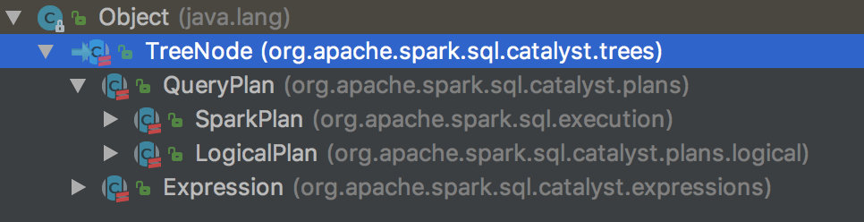
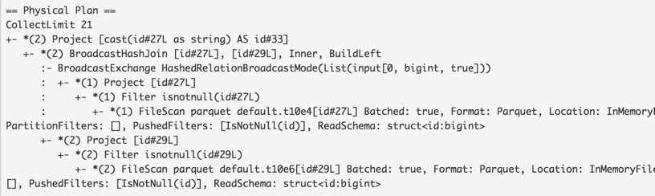

# Other Notes #
- Various blog articles from [Analytics Vidhya](https://www.analyticsvidhya.com/blog/2021/08/understanding-the-basics-of-apache-spark-rdd/) 

## Apache Spark RDD ## 
- Various blog articles from [Analytics Vidhya](https://www.analyticsvidhya.com/blog/2021/08/understanding-the-basics-of-apache-spark-rdd/) 

- [Jacek Laskowski](https://jaceklaskowski.github.io/spark-workshop/slides/spark-sql-internals-of-structured-query-execution.html#/home)
  - Structured Queries: query over data described by a schema (data has structure - think SQL)
    - Schema is a tuple of 3 elements: Name, Type, Nullability
    - Structure matters because you can begin to optimize storage 
  - Query Languages in Spark SQL: SQL, DataFrame (untyped row-based), Dataset (typed)  
    - can use: Scala, Java, Python & R
    - Dataframes & Schemas
      - DF: a collection of rows with a schema := `Dataset[Row]`
      - Row & Row Encoder 
  - Project Catalyst - Tree manipulation framework
    - TreeNode with child nodes, where children are created as Tree Nodes and it has a recursive structure
    - rules are executed sequentially and loops are supported
  
    - *Query Plan* - base node for relational operators
    - *Logical plan* - base logical query plan
    - *Spark plan* - base physical query plan
     
  - Query Execution: heart of any structured query
    - Structured query execution pipeline - has various phases (?stages?) 
    - DF.explain(): learn plans & DF.queryExecution(): to access phases 
    - *Spark Analyzer* to validate logical query plans
     
    - *Catalyst (base) Optimizer*
      - base of query optimizers, that optimizes logical plans & expressions. Allows for cost based optimization
    - *Spark Logical Optimizer*
      - custom catalyst query optimizer with new optimization rules & added extension points 
    - *Spark Planner*
      - plans optimized logical plans to physical plans - providing at LEAST 1 physical plan for each logical 
    - *Spark Physical Optimizer* for preparations rules 
      - physical query optimizations for whole-stage code generations, subqueries... rules take a spark plan and produce a sparkplan
  - Spark core's RDD
    - A job of stages that execute in distributed fashion 
    - RDD's exist in SparkContext on the driver 
    - RDD composed of partitions: parts of data, compute methods: code 
    - partitions become tasks at runtime, where a task:= your code executed on a part of data
      - tasks are executed on executors 
    - RDD lineage shows RDD with dependencies - a graph of computation steps 
    - `DF.queryExecution.toRDD()` very last phase in a query execution, where spark SQL generates RDD to execute structured query
      - RDD is like assembler or JVM bytecode vs Dataset API is scala/python