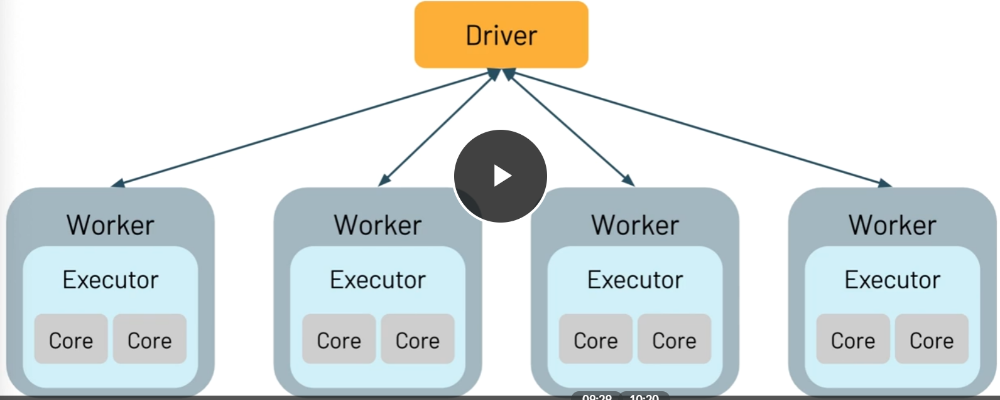

# Fundamentals Certification #
#### Reference notes and markdown
- Main Study Resources:
  - [ACloudGuru - Solutions Architect Associate](https://www.udemy.com/course/aws-certified-solutions-architect-associate/learn/lecture/13885822?start=0#overview)
    - Very good course on covering foundational services and concepts for AWS Solutions Architect
  - [AWS Certified Solutions Architect Associate Practice Exams (5)](https://www.udemy.com/course/aws-certified-solutions-architect-associate-amazon-practice-exams-saa-c02/)
    - cannot recommend this enough, while the ACloudGuru gave me the foundation and core to get about 50%, these exams and their explanations took me the rest of the way
    - EXCELLENT explanations for each question (right or wrong) as to why the correct answer is correct and all others are not as good or incorrect
  - Alternative to ACloudGuru: [OReilly AWS Certified Solutions Architect](https://learning.oreilly.com/videos/aws-certified-solutions/9780136721246/9780136721246-ACS2_00_00_00)
    - Although I never used it, this was going to be the backup course I took. I only used the question reviews at the end of each section. 
    - Much better framed to scope of AWS cert exam than acloudguru

# Apache Spark Programming with DataBricks #

## DataBricks Overview ##
- DB is a unified data analytics platform bringing together 
  - Addressing these users: data engineers, DS, ML engineers & Data analysts 
  - Data science workspace using MLFlow/PyTorch/TensorFlow 
    - this is where notepad exists 
  - unified data service using ApacheSpark and DeltaLake 
    - DB offers optimized version of Apache Spark - 3-5x faster than OSS Spark
    - benefits of Data Lake and 
    - has RT data integrations
  - Delivered on Cloud platform as a managed service - AWS & Azure 
  - plug-ins to PowerBI or Tableau 

## Spark Overview ##  
  - spark makes it possible to process big-data and do big-data workflows through distr computing 
  - SQL, graph processing 
  - largest OSS data processing and considered a standard 
  - VERY FAST for large scale data processing, easy to use & unified engine and can plug into many things
- Spark API 
  - SPark SQL + DataFrames 
    - Interactive SQL execution: allows use of spark SQL and programming abstraction called dataframes and can act as distr sql query 
    - mucho fast & integrated with spark ecosystem 
  - Spark Streaming
    - analytics needs ability to process streaming data 
    - HDFS, Kafka, Twitter ... 
  - ML lib 
    - scalable ML library with HQ algos to increase accuracy and speed 
    - available in Java, Scala & Python to be used in your workflows 
  - Spark Core 
    - R, SQL, Python, Scala, Java - can all be used for development
    - Generalized execution model 

## Spark Execution 
  - managing infra is annoying so DB offers managed solution 
  - spark uses clusters of machines to break big task into smaller pieces and distr workload across multiple machines
  - Parallelism (parallel threading) 
  - **Spark application** execution will create 
    - Multiple **Jobs** that execute in || 
    - Each job is broken up into **Stages** : set of ordered steps that together accomplish a job
    - **Tasks** are created by driver for each stage and assigned a partition of data to process 
      - they are the smallest units of work 

### Spark Application Walkthrough 

- **Driver** : machine where applicaiton runs & responsible for 3 things:
  1. Maintaining info about spark application
  2. Responding to user's program
  3. Analyzing/Distributing/Scheduling Work across Executors
  - In a single DB Cluster only ONE Driver - regardless of number of executors 
- **Worker Node** ~ VM/Machine that hosts executor processes
  - fixed # of executors allocated at any given time 
  - Each **Executor** : is process running on the worker node that performs 2 kinds of work assigned by driver 
      1. Execute code assigned by driver
      2. Report state of computation back to driver
  - Executors hold a **Spark Partition**: chunk of the data to be processed 
    - a collection of rows that sits on 1 physical machine in the cluster
    - Spark partition != NOT the same as hard disk partition - not related to storage space 
  - **Cores** AKA slots or threads 
    - *Spark || at 2 levels - a) splitting work at executor & core*
    - Executors have a # of cores/slots & each slot/core can be assigned a task

 

- analyzing clikcstream data, transactions, products, users, sales, items

