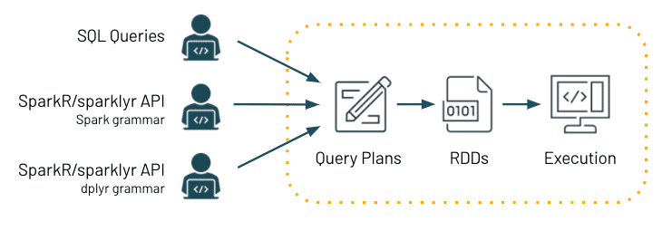
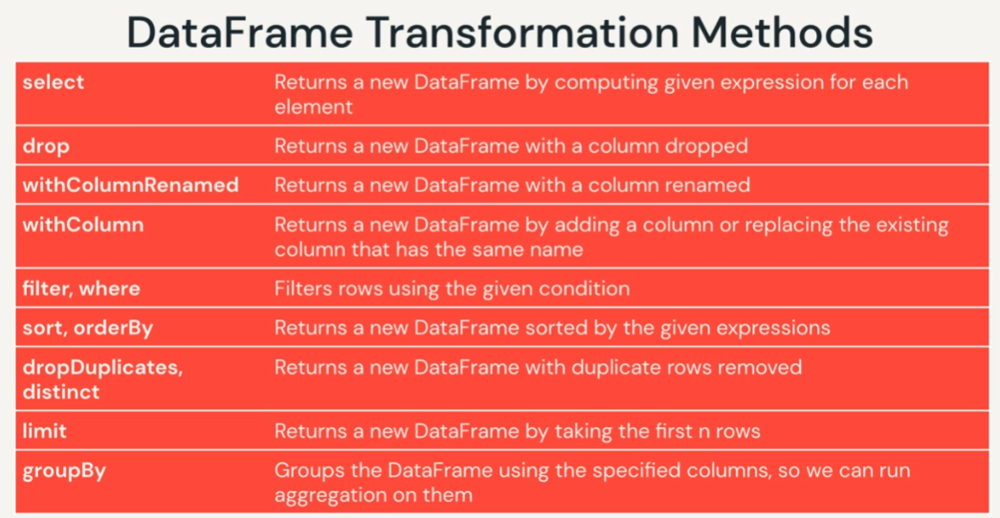
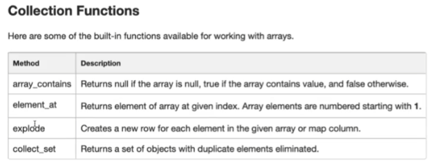

# Fundamentals Certification #
#### Reference notes and markdown
- Main Study Resources:
  - [Apache Spark for Databricks](https://partner-academy.databricks.com/learn/course/63/play/1567:253/welcome-to-the-course;lp=123)
  - [ACloudGuru - Solutions Architect Associate](https://www.udemy.com/course/aws-certified-solutions-architect-associate/learn/lecture/13885822?start=0#overview)
    - Very good course on covering foundational services and concepts for AWS Solutions Architect
  - [AWS Certified Solutions Architect Associate Practice Exams (5)](https://www.udemy.com/course/aws-certified-solutions-architect-associate-amazon-practice-exams-saa-c02/)
    - cannot recommend this enough, while the ACloudGuru gave me the foundation and core to get about 50%, these exams and their explanations took me the rest of the way
    - EXCELLENT explanations for each question (right or wrong) as to why the correct answer is correct and all others are not as good or incorrect
  - Alternative to ACloudGuru: [OReilly AWS Certified Solutions Architect](https://learning.oreilly.com/videos/aws-certified-solutions/9780136721246/9780136721246-ACS2_00_00_00)
    - Although I never used it, this was going to be the backup course I took. I only used the question reviews at the end of each section. 
    - Much better framed to scope of AWS cert exam than acloudguru

# Apache Spark Programming with DataBricks #

# DataBricks Overview #
- DB is a unified data analytics platform bringing together DS projects & workflows - ML/analytics/DS in one cloud platform 
  - Addressing these users: data engineers, DS, ML engineers & Data analysts 
  - __ML/Data Science Workspace__ using MLFlow/PyTorch/TensorFlow 
    - this is where notepad exists 
  - __Unified Data Service__ using (optimized) ApacheSpark and DeltaLake 
    - DB offers optimized version of Apache Spark - 3-5x faster than OSS Spark
    - benefits of Data Lake and 
    - has RT data integrations
  - __Enterprise Cloud Service__ Delivered on Cloud platform as a managed service - AWS & Azure
    - variety of security controls, compliance options, track billing/usage 
  - __BI Integrations__ plug-ins to PowerBI or Tableau 

## Spark Overview ##  
- spark: unified analytics engine for Bid data processing
  -  makes it possible to process big-data and do big-data workflows through distr computing 
  - SQL, graph processing 
  - largest OSS data processing and considered a standard 
  - VERY FAST for large scale data processing, easy to use & unified engine and can plug into many things
  - unified API and engine for SQL queries, streaming data and ML

- Spark API 
  - Spark SQL + DataFrames 
    - Interactive SQL execution: allows use of spark SQL and programming abstraction called dataframes and can act as distr sql query 
    - mucho fast & integrated with spark ecosystem 
  - Spark Streaming
    - analytics needs ability to process streaming data 
    - HDFS, Kafka, Flume, Twitter ... 
  - ML lib 
    - scalable ML library with HQ algos to increase accuracy and speed (100x faster than mapReduce - take that Hadoop!)
    - available in Java, Scala & Python to be used in your workflows 
  - Spark Core 
    - R, SQL, Python, Scala, Java - can all be used for development
    - Generalized execution model/engine 

# Spark Execution #
  - managing infra is annoying so DB offers managed solution 
  - spark uses clusters of machines to break big task into smaller pieces and distr workload across multiple machines
  - Parallelism (parallel threading) 
  
  - **Spark application** execution will create 
    - Multiple **Jobs** that execute in || 
    - Each job is broken up into **Stages** : set of ordered steps that together accomplish a job
    - **Tasks** are created by driver for each stage and assigned a partition of data to process 
      - they are the smallest units of work 

## Spark Application Walkthrough - DB Training


- **Driver** : machine where application runs & responsible for 3 things:
  1. Maintaining info about spark application
  2. Responding to user's program
  3. Analyzing/Distributing/Scheduling Work across Executors
  - In a single DB Cluster only ONE Driver - regardless of number of executors 
- **Worker Node** ~ VM/Machine that hosts executor processes
  - fixed # of executors allocated at any given time 
  - Each **Executor** : is process running on the worker node that performs 2 kinds of work assigned by driver 
      1. Execute code assigned by driver
      2. Report state of computation back to driver
  - Executors hold a **Spark Partition**: chunk of the data to be processed 
    - a collection of rows that sits on 1 physical machine in the cluster
    - Spark partition != NOT the same as hard disk partition - not related to storage space 
  - **Cores** AKA slots or threads 
    - *Spark || at 2 levels - a) splitting work at executor & core*
    - Executors have a # of cores/slots & each slot/core can be assigned a task

 - analyzing clickstream data, transactions, products, users, sales, items

## Spark Architecture Basics From Analytics Vidhya ##
- [Understanding Internal Working of Apache Spark](https://www.analyticsvidhya.com/blog/2021/08/understand-the-internal-working-of-apache-spark/)
- [Data Engineering Basics - Spark Architecture](https://www.analyticsvidhya.com/blog/2020/11/data-engineering-for-beginners-get-acquainted-with-the-spark-architecture/)
  - OSS distributed big data processing engine for streaming and batch data with || execution & fault tolerance 
  - APIs in Java, Scala, Python & R 
    - also integrates with Hadoop ecosystem & able to run in hadoop clusters on hadoop data sources including Cassandra
  - developed to address drawbacks of Hadoop MapReduce - meaning Apache Spark uses in-memory computation making it MUCH faster 
   
- **Spark core**: basic functionality of spark - components for task scheduling, memory management, fault recovery, interacting with storage systems... 
- home to the API that defines resilient distributed datasets (RDD) sparks main programming abstraction 
- Runtime Libraries
  - **Spark SQL** spark's package for structured data - allows SQL queries, Hive Query languages and various data sources like Hive tables, JSON & Parquet 
  - **Spark Streaming** spark component enables processing of live streams of data (logs, queues of messages, etc...)
  - **MLlib** common ML library with ML algos (Classification, regression, clustering, filtering & model evaluation, etc... ) all these are designed to scale across cluster 
  - **GraphX** library for manipulating graphs (think social networks...) and performing || graph computation, searching, pathfinding, traversal...
  - **Cluster Managers** spark designed to efficiently scale from 1 - 1000s of nodes running over variety of cluster managers: 
    - standalone scheduler: default for simple stuff - reliable and easy to manage resources on app
    - Hdoop YARN - provided in Hadoop 2: all-purpose cluster manager 
    - Apache Mesos - general cluster manager that can also run Hadoop MapReduce with Spark & others... 
    - ?K8s?
- **Spark RDD**
  - backbone of Apache Spark does 2 main things: 
    - (1) Transformations : create a new RDD 
    - (2) Actions: collect(), count() to return results

### Run-Time Execution Flow ###
 
- Basic flow: A driver program communicates with cluster manager to schedule tasks on worker nodes, once complete they send results back to driver program. 

- (A) Spark submit will create a driver program: **Spark Driver** spark driver first action is to call main method of the program (appears different from "driver" as defined by DB training)
  - (B1) when executing in spark, you give the main class which is the entry point to your program that is executed by the spark driver 
  - (C) creates a *spark context/session* that converts a job or RDD lineage into a DAG (directed acyclic graph) which splits the job/RDD lineage into stages and eventually tasks that get sent to the cluster to send to executors
  - process on a machine responsible for maintainng state of app running on the cluster
  - runs user code which creates RDD dataframes & data units abstractions 
    1. converts user program into tasks
    2. scheduels tasks on executors with the help of the cluster manager
    3. Maintains state & tasks of executors 
      - must be network accessible from worker nodes
- **Spark Cluster Manager** spark execution is agnostic to cluster manager - can use any of available cluster managers, doesn't change behavior - so long as cluster manager can provide executor processes and they communicate - spark doesn't care
  - (B2) Spark Driver will ask Cluster for worker nodes/executors  
  - Spark relies on cluster manager to 
    1. (D) *SCHEDULE & LAUNCH* executors 
    2. (D) Cluster Manager allocates resources for execution of tasks 
    - can dynamically increase/decrease executors based on workload data processing to be done 
    - these often have their own "master/worker" setup - but their terminology is primarily tied to machines rather than processes that spark works on 
- (E) **Spark Executor** a process running on worker node that runs actual programming logic of data processing in the form of tasks 
  - they will register themselvesa with driver program before beginning execution - so they can 
  - a copy of program & config put on all worker nodes so that can be locally read
  - launched at beginning of spark app & when you submit jobs, they run for lifetime of spark app (holds state)
    - this can allow isolation on scheduling side (each driver schedules its own tasks) & execution side (tasks from different apps run in different JVMs)
      - allows for data separation since data cannot be shared unless written to external storage 
  1. run tasks 
  2. return results/info on state to driver 
  2. provides in-memory storage for RDD dataset & dataframes cached by user

 

- *Execution Modes*
  - Cluster Mode (appears this is DB config - since DB driver schedules tasks across executors)
    - User submits pre-compiled JAR, Py script or R script to cluster manager
    - cluster manager launches driver process on worker node in addition to executor processes
    - cluster manager manages all spark app related stuff 
    - seems to be most scalable since you can have multi clients submit to the cluster
  - Client Mode
    - spark driver remains on client machine that submitted job 
    - spark driver exists on client machine and cluster manager maintains executor processes
    - client machines AKA gateway machines or edge nodes 
  - Local Mode (dev work)
    - runs spark app on single machine 

## DB Component Concepts

- **DB Workspace**: grouping of envm to access DB objects such as clusters, Notebooks, Jobs, Data 
  - *Interfaces*: accessible through UI, CLI & REST API
    - REST API has 2 versions: 1.2 and 2.0 - 2.0 is preferred
    - CLI is OSS on github and built on REST API 2.0 
- Workspace assets:
  - **Clusters**: set of computational resources and configs where you run your ML/data/adhoc workloads
    - run through set of comands through notebook or automated job (interactive vs batch)
    - runs DB runtime which includes Apache Spark, optimizers, Delta Lake, Java, Py, R, Scala libraries and more 
    - come in 2 kinds of clusters
      - All-purpose clusters: analyze data collaboratively using interactive notebooks, can be created via UI, manually created, and shared among many users
      - Job Clusters: run fast automated jobs - created at runtime and dynamically terminated at the end of the job (cannot restart job cluster)
  - **Notebook**: web-based UI with group of "cells" that allow you to execute commands (reformatted program)
    - DB notebooks allow execution in Scala, Python, SQL, R 
    - can be exported as DBC files that can be migrated/imported etc
    - Notebooks are the "sql client" and can be executed interactively 
    - also provides DBUtils which is only accessible through notebooks 
      - DBUtils allow you to admin obj storage & chain/parameterize notebooks & manage secrets 
  - **Job**: construct to house indv execution of a notebook run - either in ad-hoc submission (interactive) OR batch scheduled run 
    - can be created/called through UI, CLI & REST API 
    - job status can be monitored via UI, CLI, REST & email
  - Data **DB Filesystem DBFS**: distr f/s mounted into each DB workspace and is a layer over cloud object store 
    - contains directories, data, files, etc
    - auto-populated with sample files 
    - Files in DBFS are persisted in object store 
    - through DBFS can configure access controls etc to access data you need without data duplication/migration 
  - Data **Metastore** : Manages tables and permissions and enables granting of rights/sharing data 
    - defaults to databricks central hive metastore - but can be externalized

### Demo
- %fs is a dbutils shortcut to the dbutils.fs function
- Widgets are like a STP parameter you define and can edit the value and reference throughout the notebook 
    ```
    %sql 
    CREATE WIDGET TEXT state DEFAULT "CA"
    SELECT
      *
    FROM
      events
    WHERE
      geo.state = getArgument("state")
    %python
    dbutils.widgets.multiselect("colors", "orange", ["red", "orange", "black", "blue"], "Traffic Sources")
    colors = dbutils.widgets.get("colors").split(",")
      ```

# Spark SQL & DataFrames

## Spark SQL & DataFrame API Intro

- **Spark SQL** is a module for structured data processing with multiple interfaces: SQL OR Dataframe API: allowing use of Python, Scala, Java, R 
- **Query Engine**: converts execution of all queries so they can run on the same engine, therefore
  - you can have SQL, python, Scala all coding and able to share/reuse code 
  - **Query Plans**: ?query program? 
    - the translated query 
    - With databricks & Spark, it can optimize the query plan automatically before execution 
  - **RDDs**: Resilient Distr dataset (low level representation of datasets) 
    - spark converts our commands into RDD so we don't have to code in it

- **DataFrames**: distributed collection of data grouped into named columns 
- **Schema**: table metadata of dataframe (col names & types) 
  - Dataframe **transformations** are methods that return a new dataframe and are *lazily* evaluated (not actually run until later - ?view?)  
    - {select, where, orderBy, groupBy...} - creates a plan (~ to a view)
  - Dataframe **actions** are methods that trigger computation {count, collect, take, describe, summary, first/head, show...} are *eagerly* evaluated


### SparkSession 
- **SparkSession**: First step of spark application is creating a session 
  - single entry point to all dataframe API f(x)s
  - automatically created in DB notebook as var = 'spark'
  - pyspark.sql in python docs, & is useful to review both scala & python docs because they have different useful info 
- SparkSessions have the following Methods to return a dataframe:
  - sql: return dataframe result of query 
  - table: return table as a dataframe 
  - read: return dataframe reader that can be used to read data in as a dataframe 
  - range: create dataframe with column containing elements in a range from start to end with step value & # of partitions 
  - createDataFrame: creates a dataframe from list of tuples - used for testing 

- **SQL CANNOT USE DATAFRAMES** 
  - To convert a dataframe that can be used by SQL - you convert it into a view using `orig_dataframe_name.createOrReplaceTempView("new_view_name")` 
    - accessible only locally and goes away after your session
  - can also use `orig_df_name.write.mode("overwrite").saveAsTable("new_table_name")`
    - a globally available table that can persist after your session
- ? inability to use upcase in where clause in spark sql or dataframe API 
- ? inability to use spark.sql on a dataframe - needs to pull from a recognized table ? 

## DataSources - simple r/w
- CSV can be read in 
- Apache **Parquet**, columnar storage format that provides efficient stored data - available to all Hadoop ecosystem
  - allows you to load only cols you need so you don't load EVERYTHING & metadata is written in the footer of the file (sounds like easy corruption? 
  - doesn't waste space storing misisng values 
  - predicate filters - pushes filters to the source 
  - data skipping - stores min/max of each segment so you can skip entire files 
  - Tamper-resistant: tough to tamper with particular rows because of its storage format 
  - if working with streaming data, you must define schema first 
- **Delta Lake**: OSS new tech to be used with spark to build robust data lakes 
  - runs on top of existing data lake to provide 
    - stores data in parquet formats
    - ACID t(x)
    - scalable metadata
    - unified streaming/batch processing 
    - data versioning
    - schema enforcement & evolution 
    - Ingestion tables (bronze) -> refined tables (silver) -> feature/agg data store (gold)
- **DataFrameReader**: can read in data from external storage from a variety of file formats 

    ```
    newDF = (spark.read.csv("/filesystempath/table.csv", sep="\t", header=True, inferSchema=True))
    # Notice .schema is before the .<filetype parquet> - if you put it after, it throws an error. Needs to "load" schema before picking up parquet file 
    newDF = spark.read.schema(predefinedSchema).parquet("/file-system/path/table.parquet")
    ```

- **DataFrameWriter**: accessible through df method write

    ```
    (df.write 
        .option("compression","snappy")
        .mode("overwrite")
        .parquet(outPath)
    )
    ```
- can use this *%scala* command to autogenerate schema info from *parquet* files that you can then use as metadata structure ```spark.read.parquet("/file-system/path/table.parquet").schema.toDDL``` 
- by pre-defining the metadata structure, it allows you to read in files ~10x faster on community DB

## DataFrames & Columns 
- entire section is basically last-mile data prep: basic table manipulations to create new calculated variables and subset tables
- **column**: logical construct that will be computed based on data in dataframe (per record basis) using an expr AKA a *calculated field*
  - can select/manipulate/remove cols from dataframes, HOWEVER their values cannot be edited as they are *derived*
  - columns simply represent a value computed on a per-record basis by means of an expression 
    - can only be transformed within context of a dataframe
- different ways to reference column depending on language
  - different ways to create column calculations

# Transformations 

### Transformations & Actions

- column operators include comparison, basic math, changing type `cast | astype` , checking null `isNull | isNotNull | isNaN`
- these often have a corollary to SQL commands that can be used (orderBy, groupBy, limit, select, distinct, drop...)
- Actions will execute (show, count, describe, first/head, collect, take...)

### Rows 
- Methods to work with rows - length, get value of a particular position, field index...
  - get(i) is primary in scala 
- can help sort/subset rows...
  - `newDF = DF.limit(###)` works like obs in SAS - limiting # of rows read in and save to new DF
  - `purchasesDF.select("event_name","second_col").distinct()` the easiest way to make certain items
- `where | filter` are the same in pySpark 
`revenueDF = eventsDF.filter(col("ecommerce.purchase_revenue_in_usd").isNotNull())`


## Aggregation 
- Groupby / Group Data Methods / Agg F(x)s / Math F(x)s
- **groupBy**: dataframe method that groups dataframe by specified cols so you can run aggregations on them (SQL Group By) 
  - returns *GroupedData* obj in python 
    - Grouped data object in scala is called "RelationalGroupedDataset" 
  - takes columns: avg, count, max, mean, min, pivot, sum
- Built-in Functions:
  - approx_count_distinct, avg, collect_list, corr, max, mean, stddev_samp, sumDistinct, var_pop, ceil, log, round, sqrt 

- I like SQL better - BUT somehow you use dot operators for indv functions - Order of these matters
  - df.groupBy("col-name").sum("numeric") 
  - you use the agg() to allow you to perform additional dot operator functions 
  - AAAND Don't forget the IMPORT - if you don't import sum - it won't work properly! LIKE WTF
  - and you also have to do nesting of function attributes so these dot operators work: look at the sort 
    - you use the column function to house the attribute so you can use the desc option with it inside of the sort AND then apply the limit. VERY convoluted if you ask me. SQL >>>
  - and have to use funky withColumns to remake a col and round it. 

### Example Code with multi-group by, new columns rounded and sorted with a limit
```
from pyspark.sql.functions import avg, approx_count_distinct, sum, round, col
print(eventsPath) # /mnt/training/ecommerce/events/events.parquet
df = spark.read.parquet(eventsPath)
### If you want to add a where/filter - must occur BEFORE .groupBy ###
chainDF = (df.groupBy("traffic_source", "device").agg(
      sum("revenue").alias("total_rev"),
      avg("revenue").alias("avg_rev")
      )
      .withColumn("avg_rev", round("avg_rev", 2))
      .withColumn("total_rev", round("total_rev", 2))
      .sort(col("total_rev").desc())
      .limit(3)
)

# sort by 2 columns - user timestamp desc and event timestamp
eventsDF.sort(col("user_first_touch_timestamp").desc(), col("event_timestamp"))
```
- another option found through stackoverflow: You can try to use 'from pyspark.sql.functions import *' This method may lead to namespace coverage, such as pyspark 'sum' function covering python built-in 'sum' function.
- Another insurance method: `import pyspark.sql.functions as F`, use method: `F.sum`.


## Date Manipulation
- [Datetime patterns](https://spark.apache.org/docs/latest/sql-ref-datetime-pattern.html) 
- Datetime type
  - TimestampType: Represents values comprising values of fields year, month, day, hour, minute, and second, with the session local time-zone. The timestamp value represents an absolute point in time.
  - DateType: Represents values comprising values of fields year, month and day, without a time-zone.
- **Type Change:** cast, to_date
    ```
    columnName.cast("timestamp") 

    ### Need to import the TimestampType function ###
    from pyspark.sql.types import TimestampType
    columnName.cast(TimestampType())    
    ```
  - to_date converts a column to datetype() `to_date(col("columnName")) == .cast(DateType())`
    - only works with timestamp values - does not work with bigint|long|double types to date values
- **Format:** date_format
  - date_format("columnName", "MMMM dd, yyyy [date-string in pattern url above]") - RETURNS a string
- **Pulling Date attributes from a date value:**  year, month, dayofweek, minute, second, hour
  - all extract the numerical datetime item from the datetime value - `.withColumn("year", year(col("columnName")))`
- **date manipulation** with `date_add` allows you to add a numerical # of days to a date 

```
timestamp = 1593878946592107 

from pyspark.sql.types import TimestampType, DateType
from pyspark.sql.functions import date_format, hour

timestampDF = (df
        .withColumn("timestamp_orig", col("timestamp")) # long or double type that cannot be converted to DateType
        .withColumn("timestamp", (col("timestamp") / 1e6).cast("timestamp")) # division by 1MM converts to 2020 - otherwise its year 2MM or something
        .withColumn("date_type", col("timestamp").cast(DateType())) # order matters - need to pull from a timestamp value, not from a double 
        .withColumn("date string", date_format("timestamp", "MMMM dd, yyyy"))
        .withColumn("time string", date_format("timestamp", "HH:mm:ss.SSSSSS"))

        .withColumn("time string", date_format("date_type", "HH:mm:ss.SSSSSS")) # returns a string of zeros: '00:00:00.000000'
        .withColumn("HMS_dt", [hour|minute|second](col("date_type")))  # returns 0 because date_type lacks specificity for these values 
              )

timestampDF.printSchema()
#  root
#  |-- user_id: string (nullable = true)
#  |-- timestamp: timestamp (nullable = true)
#  |-- timestamp_orig: long (nullable = true)
#  |-- date_type: date (nullable = true)
#  |-- date string: string (nullable = true)
#  |-- time string: string (nullable = true)
#  |-- HMS_dt: integer (nullable = true)
```
  

from pyspark.sql.functions import avg
activeDowDF = (activeUsersDF
               .withColumn("day", date_format("date", "EEE"))
               .groupBy("day").agg(
                   avg("active_users").alias("avg_users")
               )

## String & Collection Functions





```
 |-- items: array (nullable = true)
 |    |-- element: struct (containsNull = true)
 |    |    |-- coupon: string (nullable = true)
 |    |    |-- item_id: string (nullable = true)

detailsDF = (df.withColumn("items", explode("items")) # example selected by class is lame, but you get the idea...
# input to function explode() should be array or map type, not struct 

 |-- items: struct (nullable = true)
 |    |-- coupon: string (nullable = true)
 |    |-- item_id: string (nullable = true)
```

# Other Notes #
- Various blog articles from [Analytics Vidhya](https://www.analyticsvidhya.com/blog/2021/08/understanding-the-basics-of-apache-spark-rdd/) 

## Apache Spark RDD ## 
- Various blog articles from [Analytics Vidhya](https://www.analyticsvidhya.com/blog/2021/08/understanding-the-basics-of-apache-spark-rdd/) 

