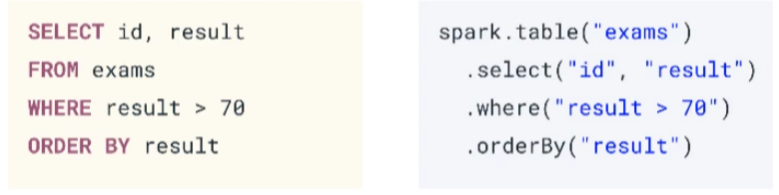

# Fundamentals Certification #
#### Reference notes and markdown
- Main Study Resources:
  - [ACloudGuru - Solutions Architect Associate](https://www.udemy.com/course/aws-certified-solutions-architect-associate/learn/lecture/13885822?start=0#overview)
    - Very good course on covering foundational services and concepts for AWS Solutions Architect
  - [AWS Certified Solutions Architect Associate Practice Exams (5)](https://www.udemy.com/course/aws-certified-solutions-architect-associate-amazon-practice-exams-saa-c02/)
    - cannot recommend this enough, while the ACloudGuru gave me the foundation and core to get about 50%, these exams and their explanations took me the rest of the way
    - EXCELLENT explanations for each question (right or wrong) as to why the correct answer is correct and all others are not as good or incorrect
  - Alternative to ACloudGuru: [OReilly AWS Certified Solutions Architect](https://learning.oreilly.com/videos/aws-certified-solutions/9780136721246/9780136721246-ACS2_00_00_00)
    - Although I never used it, this was going to be the backup course I took. I only used the question reviews at the end of each section. 
    - Much better framed to scope of AWS cert exam than acloudguru

# Apache Spark Programming with DataBricks #

## DataBricks Overview ##
- DB is a unified data analytics platform bringing together 
  - Addressing these users: data engineers, DS, ML engineers & Data analysts 
  - Data science workspace using MLFlow/PyTorch/TensorFlow 
    - this is where notepad exists 
  - unified data service using ApacheSpark and DeltaLake 
    - DB offers optimized version of Apache Spark - 3-5x faster than OSS Spark
    - benefits of Data Lake and 
    - has RT data integrations
  - Delivered on Cloud platform as a managed service - AWS & Azure 
  - plug-ins to PowerBI or Tableau 

## Spark Overview ##  
  - spark makes it possible to process big-data and do big-data workflows through distr computing 
  - SQL, graph processing 
  - largest OSS data processing and considered a standard 
  - VERY FAST for large scale data processing, easy to use & unified engine and can plug into many things
- Spark API 
  - SPark SQL + DataFrames 
    - Interactive SQL execution: allows use of spark SQL and programming abstraction called dataframes and can act as distr sql query 
    - mucho fast & integrated with spark ecosystem 
  - Spark Streaming
    - analytics needs ability to process streaming data 
    - HDFS, Kafka, Twitter ... 
  - ML lib 
    - scalable ML library with HQ algos to increase accuracy and speed 
    - available in Java, Scala & Python to be used in your workflows 
  - Spark Core 
    - R, SQL, Python, Scala, Java - can all be used for development
    - Generalized execution model 

## Spark Execution 
  - managing infra is annoying so DB offers managed solution 
  - spark uses clusters of machines to break big task into smaller pieces and distr workload across multiple machines
  - Parallelism (parallel threading) 
  - **Spark application** execution will create 
    - Multiple **Jobs** that execute in || 
    - Each job is broken up into **Stages** : set of ordered steps that together accomplish a job
    - **Tasks** are created by driver for each stage and assigned a partition of data to process 
      - they are the smallest units of work 

### Spark Application Walkthrough 


- **Driver** : machine where applicaiton runs & responsible for 3 things:
  1. Maintaining info about spark application
  2. Responding to user's program
  3. Analyzing/Distributing/Scheduling Work across Executors
  - In a single DB Cluster only ONE Driver - regardless of number of executors 
- **Worker Node** ~ VM/Machine that hosts executor processes
  - fixed # of executors allocated at any given time 
  - Each **Executor** : is process running on the worker node that performs 2 kinds of work assigned by driver 
      1. Execute code assigned by driver
      2. Report state of computation back to driver
  - Executors hold a **Spark Partition**: chunk of the data to be processed 
    - a collection of rows that sits on 1 physical machine in the cluster
    - Spark partition != NOT the same as hard disk partition - not related to storage space 
  - **Cores** AKA slots or threads 
    - *Spark || at 2 levels - a) splitting work at executor & core*
    - Executors have a # of cores/slots & each slot/core can be assigned a task

 - analyzing clikcstream data, transactions, products, users, sales, items

## DB Concepts & Demo

- **DB Workspace**: grouping of envm to access DB objects such as clusters, Notebooks, Jobs, Data 
  - accessible through UI, CLI & REST API
- Workspace assets:
  - **Clusters**: set of computational resources and configs where you run your ML/data/adhoc workloads
    - run through set of comands through notebook or automated job (interactive vs batch)
    - come in 2 kinds of clusters
      - All-purpose clusters: analyze data collaboratively using interactive notebooks, can be created via UI, manually created, and shared among many users
      - Job Clusters: run fast automated jobs - created at runtime and dynamically terminated at the end of the job (cannot restart job cluster)
  - **Notebook**: web-based UI with group of "cells" that allow you to execute commands (reformatted program)
    - DB notebooks allow execution in Scala, Python, SQL, R - 
    - can be exported as DBC files that can be migrated/imported etc
    - Notebooks are the "sql client" and can be executed interactively
  - **Job**: construct to house indv execution of a notebook run - either in ad-hoc submission OR batch scheduled run 
    - can be called through UI, CLI & REST API 
    - job status can be monitored 
  - Data **DB Filesystem DBFS**: distr f/s mounted into each DB workspace and is a layer over cloud object store 
    - contains directories, data, files, etc
    - auto-populated with sample files 
    - Files in DBFS are persisted in object store 
    - through DBFS can configure access controls etc to access data you need without data duplication/migration 
  - Data **Metastore** : Manages tables and permissions and enables granting of rights/sharing data

### Demo
- %fs is a dbutils shortcut to the dbutils.fs function
- Widgets are like a STP parameter you define and can edit the value and reference throughout the notebook 

# Spark SQL & DataFrames

## Spark SQL & DataFrame API Intro
- **Spark SQL** is a module for structured data processing with multiple interfaces: SQL OR Dataframe API allowing use of Python, Scala, Java, R 
- allows execution of all queries on the same engine, therefore
  - you can have SQL, python, Scala all coding and able to share/reuse code 
  - **Query Plans**: ?query program? 
    - will be optimized automatically before execution 
  - **RDDs**: ???  step before execution? 
- **DataFrames**: distributed collection of data goruped into named columns 
- **Schema**: table metadata of dataframe (col names & types) 
  - Dataframe **transformations** are methods that return a new dataframe and are *lazily* evaluated (not actually run until later - ?view?)  
    - {select, where, orderBy...} ?does this include group by?
  - Dataframe **actions** are methods that trigger computation {count, collect, take,  show...} are *eagerly* evaluated



### Spark Application
- **SparkSession**: First step of spark application is creating a session 
  - single entry point to all dataframe API f(x)s
  - automatically created in DB notebook as var = 'spark'
  - pyspark.sql in python docs, & is useful to review both scala & python docs because they have different useful info 
- SparkSessions have the following Methods:
  - sql: return dataframe result of query 
  - table: return table as a dataframe 
  - read: return dataframe reader that can be used to read data in as a dataframe 
  - range: create dataframe with column containing elements in a range from start to end with step value & # of partitions 
  - createDataFrame: creates a dataframe from list of tuples - used for testing 

- ? inability to use upcase in where clause in spark sql or dataframe API 
- ? inability to use spark.sql on a dataframe - needs to pull from a recognized table ? 

## DataSources 
- CSV can be read in 
- Apache **Parquet**, columnar storage format that provides efficient stored data - available to all Hadoop ecosystem
  - allows you to load only cols you need so you don't load EVERYTHING & metadata is written in the footer of the file (sounds like easy corruption? 
  - doesn't waste space storing misisng values 
  - predicate filters - pushes filters to the source 
  - data skipping - stores min/max of each segment so you can skip entire files 
  - Tamper-resistant: tough to tamper with particular rows because of its storage format 
  - if working with streaming data, you must define schema first 
- **Delta Lake**: new tech to be used with spark to build robust data lakes 
  - runs on top of existing data lake to provide 
    - stores data in parquet formats
    - ACID t(x)
    - scalable metadata
    - unified streaming/match processing 
- **DataFrameReader**: can read in data from external storage from a variety of file formats 

    ```spark.read.parquet("/file-system/path/table.parquet")```

- **DataFrameWriter**: accessible through df method write

    ```
    (df.write 
        .option("compression")
        .mode("overwrite")
        .parquet(outPath)
    )
    ```
- can use this scala command to autogenerate schema info that you can then use as metadata structure ```spark.read.parquet("/file-system/path/table.parquet").schema.toDDL```
