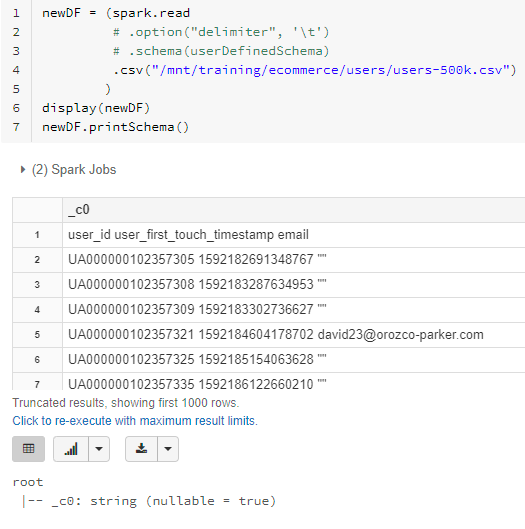
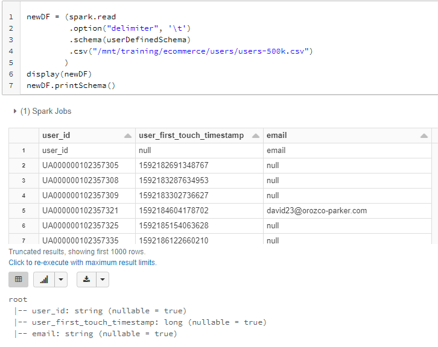

# Spark SQL & DataFrames
??? check distinct() - can it contain stuff in it? or just dot operator? 
### DBUTILS
- %fs is a dbutils shortcut to the dbutils.fs function
- Widgets are like a STP parameter you define and can edit the value and reference throughout the notebook 

```
    %sql 
    CREATE WIDGET TEXT state DEFAULT "CA"
    SELECT
      *
    FROM
      events
    WHERE
      geo.state = getArgument("state")
    %python
    dbutils.widgets.multiselect("colors", "orange", ["red", "orange", "black", "blue"], "Traffic Sources")
    colors = dbutils.widgets.get("colors").split(",")
```

```
df = spark.read.parquet(eventsPath)
limitEventsDF = (df.filter(col("event_name") != "reviews"))
EventsDF2 = limitEventsDF.withColumn("event_timestamp", (col("event_timestamp") / 1e6).cast("timestamp"))

Physical plan:
Project - convert to event timestamp
Filter where event_name != reviews
Pull from parquet file using filter
```
- doesn't work oin csv files - Note the presence of a Filter and PushedFilters in the FileScan csv 
  - Again, we see PushedFilters because Spark is trying to push down to the CSV file.
  - However, this does not work here, and thus we see, like in the last example, we have a Filter after the FileScan, actually an InMemoryFileIndex.
 ```
 == Physical Plan ==
*(1) Filter (isnotnull(site#1206) AND (site#1206 = desktop))
+- FileScan csv [timestamp#1205,site#1206,requests#1207] Batched: false, DataFilters: [isnotnull(site#1206), (site#1206 = desktop)], Format: CSV, Location: InMemoryFileIndex[dbfs:/mnt/training/wikipedia/pageviews/pageviews_by_second.tsv], PartitionFilters: [], PushedFilters: [IsNotNull(site), EqualTo(site,desktop)], ReadSchema: struct<timestamp:timestamp,site:string,requests:int>
```

## Partitioning ## 
- Spark by default partitions data across # of threads available for execution slots/cores may not be the same thing 
- `spark.sparkContext.defaultParallelism` will return # of cores in cluster 
  - local mode has cores on local machine - Mesos etc, has min of 2 or cores on machine...
- Num of partitions of data `df.rdd.getNumPartitions()`

- **coalesce()** - narrow transformation: no shuffling, doesn't increase partitions
  - returns new DF with exactly N partitions (decrease number of partitions from current #, to N)
    - cannot coalesce to # greater than current # of partitions
    - cannot guarantee equal partition sizes
    - used to reduce partitions w/o shuffle
- **repartition()** - wide transformation: reshuffles ALL data, *evenly* balances partition sizes
  - returns new DF with exactly N partitions uniformly distributed - used to repartition to MORE partitions or EVEN out by shuffling data
    - if you try and repartiton on a col - it will automatically default to `spark.sql.shuffle.partitions` which = 200 by default. 
- General rule - when partitioning, # of partitions to = # of cores - or at least a MULTIPLE of the # of cores
  - each partition, when cached is ~ 200 MB is considered optimal based on real-world exp 
- If i read data in with 10 partitions - do I decrease to 8 partitions? or increase to 16? 
  - depends on size of partitions, if they are small - can decrease to 8 so its  <200 MB, or spread to 16 to get <200 MB
  - Goal is to reduce num of partitions while keeping 1x # of slots
- Wide Transformations: once data is shuffled, it has to be repartitioned
  - `spark.conf.get("spark.sql.shuffle.partitions" [, "8"])` default value - 200 MB size, new partition size assigned 
    - can be tweaked using the above command to tweak the value
- **Partition Guidelines**
  - too many smaller partitions > too few large partitions 
  - Partition sizes <200MB per 8 GB of core total memory: 1/40 ratio  
    - small data - 3 partitions per core??? 
  - size default partition by dividing largest shuffle stage in put by target partition size: 4GB / 200MB = 20 shuffle partitions 
- Dynamically coalesce shuffle partitions (only in AQE Spark 3.0)
  - Best # of partitions changes based on data, the query, etc... so its best if program does it for us
  - can set large # of partitions at the beginning, then let query optimize and group into larger, more uniform partitions

```
groupdf.rdd.getNumPartitions() = returns # of partitions
coalesceDF = groupdf.coalesce(6)
repartDF = groupdf.repartition(8)  ## can repratition to lower number of partitions, will reshuffle to create equal sized partitions
repartDF.rdd.getNumPartitions()  ==>> returns 8 

(df.write.format("parquet")
  .repartition(13)
  .partitionBy("src")       ## can partition by a col 
  .option("path", "/user/mapr/data/flights")
  .saveAsTable("flights"))

  df.write.format("parquet")
.sortBy("id")
.partitionBy("src")
.bucketBy(4,"dst","carrier")
.option("path", "/user/mapr/data/flightsbkdc")
.saveAsTable("flightsbkdc")
```
### Cache & Loading DF to memory 
- cache & persist both offer ways to store intermediate df results to be reused in subsequent results 
- `df.cache() == df.persist(StorageLevel.MEMORY_AND_DISK)` is MEMORY_AND_DISK meaning that partitions that do not fit into memory are stored on disk 
  - is a lazy operation - not cached until you take an action 
  - `sampleRDD.cache()` will cache an RDD into memory by default 
  - use `df.unpersist()` to manually remove from memory 
- `MEMORY_ONLY` – This is the default behavior of the RDD cache() method and stores the RDD or DataFrame as deserialized objects to JVM memory. When there is no enough memory available it will not save DataFrame of some partitions and these will be re-computed as and when required. This takes more memory. but unlike RDD, this would be slower than MEMORY_AND_DISK level as it recomputes the unsaved partitions and recomputing the in-memory columnar representation of the underlying table is expensive
- `MEMORY_AND_DISK_2` can duplicate data on multiple nodes - to make data more fault resistant by having copies that can be used immediately should failure occur
```
# Below will fit all partitions it can into memory, and only recompute partitions when needed
from pyspark import StorageLevel
transactionsDF.persist(StorageLevel.MEMORY_ONLY)  
```

## SparkSession 

- **SparkSession**: First step of spark application is creating a session 
  - single entry point to all dataframe API f(x)s
  - automatically created in DB notebook as var = 'spark'
  - pyspark.sql in python docs, & is useful to review both scala & python docs because they have different useful info 
- SparkSessions have the following Methods to return a dataframe:
  - sql: return dataframe result of query 
  - table: return table as a dataframe 
  - read: return dataframe reader that can be used to read data in as a dataframe 
  - range: create dataframe with column containing elements in a range from start to end with step value & # of partitions 
  - createDataFrame: creates a dataframe from list of tuples - used for testing 

# Programming in PySpark #
- **SQL CANNOT USE DATAFRAMES** 
  - To convert a dataframe that can be used by SQL - you convert it into a view using `orig_dataframe_name.createOrReplaceTempView("new_view_name")` 
    - accessible only locally and goes away after your session
  - can also use `orig_df_name.write.mode("overwrite").saveAsTable("new_table_name")`
    - a globally available table that can persist after your session
- ? inability to use upcase in where clause in spark sql or dataframe API 
- ? inability to use spark.sql on a dataframe - needs to pull from a recognized table ? 

## DataSources - simple r/w
- CSV can be read in 
- Apache **Parquet**, columnar storage format that provides efficient stored data - available to all Hadoop ecosystem
  - allows you to load only cols you need so you don't load EVERYTHING & metadata is written in the footer of the file (sounds like easy corruption? 
  - doesn't waste space storing misisng values 
  - predicate filters - pushes filters to the source 
  - data skipping - stores min/max of each segment so you can skip entire files 
  - Tamper-resistant: tough to tamper with particular rows because of its storage format 
  - if working with streaming data, you must define schema first 
- **Delta Lake**: OSS new tech to be used with spark to build robust data lakes 
  - runs on top of existing data lake to provide 
    - stores data in parquet formats
    - ACID t(x)
    - scalable metadata
    - unified streaming/batch processing 
    - data versioning
    - schema enforcement & evolution 
    - Ingestion tables (bronze) -> refined tables (silver) -> feature/agg data store (gold)

### **DataFrameReader**: can read in data from external storage from a variety of file formats 
[SparkByExamples - Read into DF](https://sparkbyexamples.com/pyspark/pyspark-read-csv-file-into-dataframe/)
```
BASIC EXAMPLE:
newDF = (spark.read.csv("/filesystempath/table.csv", sep="\t", header=True, inferSchema=True))
# Notice .schema is before the .<filetype parquet> - if you put it after, it throws an error. Needs to "load" schema before picking up parquet file 
newDF = spark.read.schema(predefinedSchema).parquet("/file-system/path/table.parquet")
```
- **Build-up of read Example**

```
EXAMPLE ONE:
Given a csv file with: 'user_id\tuser_first_touch_timestamp\temail\nUA000000102357305\t1592182691348767\t""\nUA000000102357308\t1592183287634953\t""\n
newDF = (spark.read.csv("/mnt/training/ecommerce/users/users-500k.csv") )
display(newDF)
newDF.printSchema()
```
- csv only - tries to read in using default delimiters - so entire row read into single column as a string
- csv delimiter - reads everything into string cols starting with the first line - see it as row one, no names for columns
- csv schema - without delimiter, everythign goes into first string col - others remain empty 
- csv schema delimiter - reads everything into schema, and note that colnames are there now - but header still takes up first line. Is null on first line because "user_first_touch_timestamp" is not a LONG type
- **TIP**
  - can use this *%scala* command to autogenerate schema info from *parquet* files that you can then use as metadata structure ```spark.read.parquet("/file-system/path/table.parquet").schema.toDDL``` 
  - by pre-defining the metadata structure, it allows you to read in files ~10x faster on community DB







```
newDF = (spark.read
         .option("delimiter", '\t') # OPTION is a key/value thing: option name and value
         .option("header", True)
         .schema(userDefinedSchema)
         .csv("/mnt/training/ecommerce/users/users-500k.csv")
        )
display(newDF)
newDF.printSchema()
=== EQUIVALENT TO ===
newDF2 = (spark.read
          .options(delimiter='\t', header=True)  # OPTION*S* IS DIFFERENT FROM OPTION
          .schema(userDefinedSchema) 
          .csv(usersCsvPath)
          .where("user_first_touch_timestamp >= 1592186122660210")  # where/filter MUST be at the end, because you can only filter AFTER you specify data
)

spark.read.schema(fileSchema).format("parquet").load(filePath)
```


### **DataFrameWriter**: accessible through df method write
[SparkByExamples spark.write csv](https://sparkbyexamples.com/spark/spark-write-dataframe-to-csv-file/)
```
    (df.write 
        .option("compression","snappy")
        .mode("overwrite")
        .parquet(outPath)
    )

    usersDF2p = usersDF.coalesce(2)  # set so that only 2 partitions for this dataset
    (usersDF2p.write
      .option('delimiter', ':')
      .option("header", True)
      .option("compression", "gzip")
      .mode("overwrite")
      .csv("/user/marc.leprince@erigo-c.com/spark_programming/1_4_reader_writer/csv2")
    )
    display(dbutils.fs.ls("/user/marc.leprince@erigo-c.com/spark_programming/1_4_reader_writer/csv2"))

### Write a csv file in one big file where nulls are 'n/a'
    transactionsDf
      .repartition(1)
      .write.option("sep", "\t")
      .option("nullValue", "n/a")
      .csv(csvPath)
```
- **Saving Mode Types**
  - overwrite – mode is used to overwrite the existing file.
  - append – To add the data to the existing file.
  - ignore – Ignores write operation when the file already exists.
  - error – This is a default option when the file already exists, it returns an error.

- will write out however many partitions there are into your specified directory 
  - has some start/committed files there too


## DataFrames & Columns 
- entire section is basically last-mile data prep: basic table manipulations to create new calculated variables and subset tables
- **column**: logical construct that will be computed based on data in dataframe (per record basis) using an expr AKA a *calculated field*
  - can select/manipulate/remove cols from dataframes, HOWEVER their values cannot be edited as they are *derived*
  - columns simply represent a value computed on a per-record basis by means of an expression 
    - can only be transformed within context of a dataframe
- different ways to reference column depending on language
  - different ways to create column calculations
- To rename columns: `.withColumnRenamed("ExistingColName", "NewColName")`

# Transformations 

### Transformations & Actions

- column operators include comparison, basic math, changing type `cast | astype` , checking null `isNull | isNotNull | isNaN`
- these often have a corollary to SQL commands that can be used (orderBy, groupBy, limit, select, distinct, drop...)
- Actions will execute (show, count, describe, first/head, collect, take...)

- `df.collect()` retrieves all elements in a df as an array of Row type to the driver node yielding the result: 
```
[Row(dept_name='Finance', dept_id=10), 
Row(dept_name='Marketing', dept_id=20), 
Row(dept_name='Sales', dept_id=30), 

# Returns value of First Row, First Column which is "Finance"
deptDF.collect()[0][0]
# returns the first element in an array (1st row)
deptDF.collect()[0]
```
- Usually, collect() is used to retrieve the action output when you have very small result set and calling collect() on an RDD/DataFrame with a bigger result set causes out of memory as it returns the entire dataset (from all workers) to the driver hence we should avoid calling collect() on a larger dataset.

- `take(n: Int) == head(n: Int)` Take the first num elements of the RDD.

### Rows 
- Methods to work with rows - length, get value of a particular position, field index...
  - get(i) is primary in scala 
- can help sort/subset rows...
  - `newDF = DF.limit(###)` works like obs in SAS - limiting # of rows read in and save to new DF
  - `purchasesDF.select("event_name","second_col").distinct()` the easiest way to make a unique set of *columns selected* 
    - works like SQL distinct 
  - `df.dropDuplicates(['col1', 'col2']).select("event_name","second_col")` is equivalent to the distinct above - but it doesn't drop other columns unless you specify 
    - takes an array of col values 
    - with no col name - it will remove duplicate rows from a df
- `where | filter` are the same in pySpark 
`revenueDF = eventsDF.filter(col("ecommerce.purchase_revenue_in_usd").isNotNull())`


## Aggregation 
- Groupby / Group Data Methods / Agg F(x)s / Math F(x)s
- **groupBy**: dataframe method that groups dataframe by specified cols so you can run aggregations on them (SQL Group By) 
  - returns *GroupedData* obj in python 
    - Grouped data object in scala is called "RelationalGroupedDataset" 
  - takes columns: avg, count, max, mean, min, pivot, sum
- Built-in Functions:
  - approx_count_distinct, avg, collect_list, corr, max, mean, stddev_samp, sumDistinct, var_pop, ceil, log, round, sqrt 

- I like SQL better - BUT somehow you use dot operators for indv functions - Order of these matters
  - df.groupBy("col-name").sum("numeric") 
  - you use the agg() to allow you to perform additional dot operator functions 
  - AAAND Don't forget the IMPORT - if you don't import sum - it won't work properly! LIKE WTF
  - and you also have to do nesting of function attributes so these dot operators work: look at the sort 
    - you use the column function to house the attribute so you can use the desc option with it inside of the sort AND then apply the limit. VERY convoluted if you ask me. SQL >>>
  - and have to use funky withColumns to remake a col and round it. 

### Example Code with multi-group by, new columns rounded and sorted with a limit
```
from pyspark.sql.functions import avg, approx_count_distinct, sum, round, col
print(eventsPath) # /mnt/training/ecommerce/events/events.parquet
df = spark.read.parquet(eventsPath)
### If you want to add a where/filter - must occur BEFORE .groupBy ###
chainDF = (df.groupBy("traffic_source", "device").agg(
      sum("revenue").alias("total_rev"),
      avg("revenue").alias("avg_rev")
      )
      .withColumn("avg_rev", round("avg_rev", 2))
      .withColumn("total_rev", round("total_rev", 2))
      .sort(col("total_rev").desc())  # automatically puts nulls at the bottom ==  .sort(col("total_rev"), ascending=False)
      .limit(3)
)
# BUT if you sort ascending - nulls automatically go to the top - can use below to put nulls at the bottom - desc_nulls_last also works
.sort(asc_nulls_last(col("avg_purchase_revenue")))

# sort by 2 columns - user timestamp desc and event timestamp
eventsDF.sort(col("user_first_touch_timestamp").desc(), col("event_timestamp"))

#are all ascending 
- transactionsDf.sort(col("value"))
- transactionsDf.sort(asc(col("value")))
- transactionsDf.sort(asc("value"))
- transactionsDf.sort(transactionsDf.value.asc())
- transactionsDf.sort(transactionsDf.value)
```
- another option found through stackoverflow: You can try to use 'from pyspark.sql.functions import *' This method may lead to namespace coverage, such as pyspark 'sum' function covering python built-in 'sum' function.
- Another insurance method: `import pyspark.sql.functions as F`, use method: `F.sum`.

```
# Compound conditions
(col("storeId").between(20, 30)) & (col("productId")==2) 
# .between() is a valid function that resolves to ((storeId >= 20) AND (storeId <= 30))
# '| &' is how you chain the two booleans - 'and &&' do NOT work
```

## Date Manipulation
- [Datetime patterns](https://spark.apache.org/docs/latest/sql-ref-datetime-pattern.html) 
- Datetime type
  - TimestampType: Represents values comprising values of fields year, month, day, hour, minute, and second, with the session local time-zone. The timestamp value represents an absolute point in time.
  - DateType: Represents values comprising values of fields year, month and day, without a time-zone.
- **Type Change:** cast, to_date
    ```
    columnName.cast("timestamp") 

    ### Need to import the TimestampType function ###
    from pyspark.sql.types import TimestampType
    columnName.cast(TimestampType())    
    ```
  - to_date converts a column to datetype() `to_date(col("columnName")) == .cast(DateType())`
    - only works with timestamp values - does not work with bigint|long|double types to date values
- **Format:** date_format
  - date_format("columnName", "MMMM dd, yyyy [date-string in pattern url above]") - RETURNS a string
- **Pulling Date attributes from a date value:**  year, month, dayofweek, minute, second, hour
  - all extract the numerical datetime item from the datetime value - `.withColumn("year", year(col("columnName")))`
- **date manipulation** with `date_add` allows you to add a numerical # of days to a date 

```
timestamp = 1593878946592107 

from pyspark.sql.types import TimestampType, DateType
from pyspark.sql.functions import date_format, hour

timestampDF = (df
        .withColumn("timestamp_orig", col("timestamp")) # long or double type that cannot be converted to DateType
        .withColumn("timestamp", (col("timestamp") / 1e6).cast("timestamp")) # division by 1MM converts to 2020 - otherwise its year 2MM or something
        .withColumn("date_type", col("timestamp").cast(DateType())) # order matters - need to pull from a timestamp value, not from a double 
        .withColumn("date string", date_format("timestamp", "MMMM dd, yyyy"))
        .withColumn("timestamp_timestring", date_format("timestamp", "HH:mm:ss.SSSSSS"))

        .withColumn("date_timestring", date_format("date_type", "HH:mm:ss.SSSSSS")) # returns a string of zeros: '00:00:00.000000'
        .withColumn("HMS_dt", hour(col("date_type")))  # returns 0 because date_type lacks specificity for these values 
              )
timestampDF.display()
timestampDF.printSchema()

timestampDF.printSchema()
#  root
#  |-- user_id: string (nullable = true)
#  |-- timestamp: timestamp (nullable = true)
#  |-- timestamp_orig: long (nullable = true)
#  |-- date_type: date (nullable = true)
#  |-- date string: string (nullable = true)   
#  |-- timestamp_timestring: string (nullable = true)
#  |-- date_timestring: string (nullable = true)
#  |-- HMS_dt: integer (nullable = true)
```
  

from pyspark.sql.functions import avg
activeDowDF = (activeUsersDF
               .withColumn("day", date_format("date", "EEE"))
               .groupBy("day").agg(
                   avg("active_users").alias("avg_users")
               )

## String & Collection Functions


```
 |-- items: array (nullable = true)
 |    |-- element: struct (containsNull = true)
 |    |    |-- coupon: string (nullable = true)
 |    |    |-- item_id: string (nullable = true)

detailsDF = (df.withColumn("items", explode("items")) # example selected by class is lame, but you get the idea...
# input to function explode() should be array or map type, not struct 

 |-- items: struct (nullable = true)
 |    |-- coupon: string (nullable = true)
 |    |-- item_id: string (nullable = true)
```


```
details = ["Premium", "King", "Mattress"]

mattressDF = (detailsDF.filter(array_contains(col("details"), "Mattress")) # use array_contains to do filters on values
  .withColumn("size", element_at(col("details"), 2)) # explode will create new rows - withColumn for each element in an array to create columns from array elements - note that it is 1,2,3 position and NOT 0,1,2
  .withColumn("quality", element_at(col("details"), 1))
)
### Split examples - will default to breaking apart a string into an array based on the delimiter ~ data to columns in excel 
df4 = spark.createDataFrame([('oneAtwoBthree',)], ['str',])
df4.select(split(df4.str, '[AB]').alias('str')).show()
+-----------------+
|              str|
+-----------------+
|[one, two, three]|
+-----------------+
##### Split can also be provided a numerical parameter that specifies the number of resulting array items you want (2 means you want 2 items in your target array)
df4.select(split(df4.str, '[AB]',2).alias('str')).show()
+----------------+
|             str|
+----------------+
|[one, twoBthree]|
+----------------+

  ('Jen','Mary','Brown','1980-02-17')
  df1 = df.withColumn('year', split(df['dob'], '-').getItem(0)) \
       .withColumn('month', split(df['dob'], '-').getItem(1)) \
       .withColumn('day', split(df['dob'], '-').getItem(2))

### Use groupBy AND agg(collect_set(...)) to group string values into arrays for each unique row
    # collect_set will de-dup and present unique set - whereas collect_list will collect all elements
optionsDF = (unionDF.groupBy("email")
  .agg(collect_set("size").alias("size options"),
       collect_set("quality").alias("quality options"))
)
email | size    ->  email | size_collectset | size_collectlist
 a@b  | S       ->  a@b   | ["S", "L"]      | ["S", "L", "L"]
 b@c  | M       ->  b@c   | ["M"]           | ["M"]
 a@b  | L       ->  c@d   | []              | []
 a@b  | L       ->
 c@d  | (null)  ->
```
## Other functions
- **lit()**: creates a column of literal value
- **isnull()**: returns boolean of true if column is null 
- **rand()**: generates random col with indp & identically distributed samples uniformly distributed in [0.0,1.0)
- **dropna()**: omitting rows with any/all or specified # of null values for all/subset of cols 
  - `transactionsDf.dropna(thresh=4)` will ensure that a row has at least 4 non-null values per row and drop all others
  - if you had a 6 col df, and want to remove all missing data with 3 nulls, you want at least 4 valid values, so threshold = 4
- **fill()** replace null values with specified value for all/subset of cols 
  - invoked by `.na.fill('value to put in column',"colName")` and can chain together to do 1 col by 1 col
  - OR JSON array `.na.fill({"city-colname1": "unknown", "type-colname2": ""})`
- **replace()**: returns new df replacing a value with another value

## in this DB course they TOTALLY skip how to do joins - are you kidding me??? 
https://sparkbyexamples.com/pyspark/pyspark-join-explained-with-examples/ 

```
conversionsDF = (usersDF.join(convertedUsersDF, usersDF.email == convertedUsersDF.email,"outer"))
    will create 2 columns with identical names - but from different sources:
    root
    |-- user_id: string (nullable = true)
    |-- user_first_touch_timestamp: long (nullable = true)
    |-- email: string (nullable = true)
    |-- email: string (nullable = true)
    |-- converted: string (nullable = true)

conversionsDF = (usersDF.join(convertedUsersDF,"email","outer")
    does an automatic coalesce? - seems only way to coalesce otherwise is prior rename of cols

### Broadcast join - where you use broadcast(df) to send the smaller DF to all executors to be merged with the larger dataset 
from pyspark.sql.functions import broadcast
itemsDf.join(broadcast(transactionsDf), itemsDf.itemId == transactionsDf.storeId).show()

    .na.fill('False',"converted")    # Is == to more specific .na.fill(value='False',subset=["converted"] )
                  
Filters also don't make much sense:

abandonedCartsDF = (emailCartsDF.filter(col("converted") == 'False')
                    .filter(col("cart").isNotNull())   )
===
abandonedCartsDF2 = (emailCartsDF.filter( "converted = 'False' and cart IS NOT NULL" ) )
df.filter(df.state != "OH") == df.filter(~(df.state == "OH")) == df.filter(col("state") != "OH")
# THIS DOES NOT WORK: df.filter("device" != 'macOS') - because it expects the entire thing to be a SQL string query 
```

## User Defined Functions (UDFs)
- custom transformation functions applied to spark dataframes
- CONS of UDF tldr; it's slow
  - cannot be optimized by catalyst optimizeer
  - Function must be serialized and then sent to executors 
    - row data is deserialized from spark's native binary format to pass to UDF, then results serialized back into spark's native binary format
  - overhead from python interpreter & on executors running the UDF
- pandas/vectorized UDFs use apache arrow to speed up exec - in test envnm - run about the same
!!! review how to register UDFs - syntax and usage !!!
```
def firstLetterFunction(email):  # defining function
  return email[0]
firstLetterUDF = udf(firstLetterFunction)  # serializes f(x) to be sent to executors so it can now be used on dataframes
from pyspark.sql.functions import col
display(salesDF.select(firstLetterUDF(col("email")))) # applied to col

# to use in SQL - need to use this registration
spark.udf.register("sql_udf", firstLetterFunction)
spark.udf.register('power_5_udf', pow_5, T.LongType())
%sql
SELECT sql_udf(email) AS firstLetter FROM sales 

# Vectorized UDFs - with pandas 
from pyspark.sql.functions import pandas_udf
vectorizedUDF = pandas_udf(lambda s: s.str[0], "string")  
display(salesDF.select(vectorizedUDF(col("email"))))

```
```
find_most_freq_letter_udf = udf(find_most_freq_letter)
itemsDf.withColumn("most_frequent_letter", find_most_freq_letter_udf("itemName"))
```
- Spark should use the previously registered find_most_freq_letter_udf method here – but it is not doing that in the original codeblock. There, it just uses the non-UDF version of the Python method.

- Note that typically, we would have to specify a return type for udf(). Except in this case, since the default return type for udf() is a string which is what we are expecting here. If we wanted to return an integer variable instead, we would have to register the Python function as UDF using find_most_freq_letter_udf = udf(find_most_freq_letter, IntegerType()).

### Sample

Answering this question correctly depends on whether you understand the arguments to the DataFrame.sample() method (link to the documentation below). The arguments are as follows: `DataFrame.sample(withReplacement=None, fraction=None, seed=None)`.

The first argument withReplacement specified whether a row can be drawn from the DataFrame multiple times. By default, this option is disabled in Spark. But we have to enable it here, since the question asks for a row being able to appear more than once. So, we need to pass True for this argument.

About replacement: "Replacement" is easiest explained with the example of removing random items from a box. When you remove those "with replacement" it means that after you have taken an item out of the box, you put it back inside. So, essentially, if you would randomly take 10 items out of a box with 100 items, there is a chance you take the same item twice or more times. "Without replacement" means that you would not put the item back into the box after removing it. So, every time you remove an item from the box, there is one less item in the box and you can never take the same item twice.

The second argument to the withReplacement method is fraction. This referes to the fraction of items that should be returned. In the question we are asked for 150 out of 1000 items – a fraction of 0.15.

The last argument is a random seed. A random seed makes a randomized processed repeatable. This means that if you would re-run the same sample() operation with the same random seed, you would get the same rows returned from the sample() command. There is no behavior around the random seed specified in the question. The varying random seeds are only there to confuse you!

- in pyspark `col("column").contains('<string>')` is meant to see if a certain string exists in a particular column 
  - for example if ab exists in abs
- `col("column").isin("Bob","Mike")` is for checking if a list of elements matches a column value
  - if Bob or Mike exists in the column name for example 