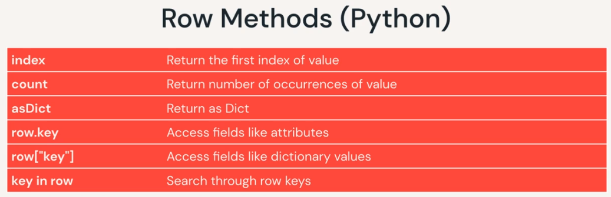

# Spark SQL & DataFrames

### DBUTILS
- %fs is a dbutils shortcut to the dbutils.fs function
- Widgets are like a STP parameter you define and can edit the value and reference throughout the notebook 
    ```
    %sql 
    CREATE WIDGET TEXT state DEFAULT "CA"
    SELECT
      *
    FROM
      events
    WHERE
      geo.state = getArgument("state")
    %python
    dbutils.widgets.multiselect("colors", "orange", ["red", "orange", "black", "blue"], "Traffic Sources")
    colors = dbutils.widgets.get("colors").split(",")
      ```

## Spark SQL & DataFrame API Intro

- **Spark SQL** is a module for structured data processing with multiple interfaces: SQL OR Dataframe API: allowing use of Python, Scala, Java, R 
- **Query Engine**: converts execution of all queries so they can run on the same engine, therefore
  - you can have SQL, python, Scala all coding and able to share/reuse code 
  - **Query Plans**: ?query program? 
    - the translated query 
    - With databricks & Spark, it can optimize the query plan automatically before execution 
  - **RDDs**: Resilient Distr dataset (low level representation of datasets) 
    - spark converts our commands into RDD so we don't have to code in it

- **DataFrames**: distributed collection of data grouped into named columns 
- **Schema**: table metadata of dataframe (col names & types) 
  - Dataframe **transformations** are methods that return a new dataframe and are *lazily* evaluated (not actually run until later - ?view?)  
    - {select, where, orderBy, groupBy...} - creates a plan (~ to a view)
  - Dataframe **actions** are methods that trigger computation {count, collect, take, describe, summary, first/head, show...} are *eagerly* evaluated

## Stages of Query Optimization

- When you submit a query to Spark it goes through various stages before it is executed
  - doesn't matter whether query from SQL, scala or python - if you go through the API it goes through this
  1. Unresolved Logical Plan: Query is parsed - tablenames, etc are not resolved 
  2. Analysis through Metadata Catalog: tablenames, columns are validated against catalog
  3. Logical plan: Valid query 
  4. Logical Optimization through Catalyst Catalog: First set of optimizations, rewrite/reorder, dedup...
  5. Optimized Logical Plan: generated from catalyst catalog optimization
  6. Physical Plans: Catalyst optimizer determines how/when to optimize  and generates 1+ physical plan(s) 
    - different from optimized, because optimization has been applied 
  7. Each optimization applied leads to a different cost-based plan which is put through a cost model
  8. Most optimal physical plan is selected and compiled to RDDs for execution 
- Adaptive Query Execution (AQE) in Spark 3.0+
  - disabled by default, recommended to enable - provides runtime stats plugged into logical plan 
  - can dynamically re-optimize queries like: switching join strategies, coalesce shuffle partitions

```
df = spark.read.parquet(eventsPath)
limitEventsDF = (df.filter(col("event_name") != "reviews"))
EventsDF2 = limitEventsDF.withColumn("event_timestamp", (col("event_timestamp") / 1e6).cast("timestamp"))

Physical plan:
Project - convert to event timestamp
Filter where event_name != reviews
Pull from parquet file using filter
```
- doesn't work oin csv files - Note the presence of a Filter and PushedFilters in the FileScan csv 
  - Again, we see PushedFilters because Spark is trying to push down to the CSV file.
  - However, this does not work here, and thus we see, like in the last example, we have a Filter after the FileScan, actually an InMemoryFileIndex.
 ```
 == Physical Plan ==
*(1) Filter (isnotnull(site#1206) AND (site#1206 = desktop))
+- FileScan csv [timestamp#1205,site#1206,requests#1207] Batched: false, DataFilters: [isnotnull(site#1206), (site#1206 = desktop)], Format: CSV, Location: InMemoryFileIndex[dbfs:/mnt/training/wikipedia/pageviews/pageviews_by_second.tsv], PartitionFilters: [], PushedFilters: [IsNotNull(site), EqualTo(site,desktop)], ReadSchema: struct<timestamp:timestamp,site:string,requests:int>
```

## Partitioning ## 
- Spark by default partitions data across # of threads available for execution slots/cores may not be the same thing 
- `spark.sparkContext.defaultParallelism` will return # of cores in cluster 
  - local mode has cores on local machine - Mesos etc, has min of 2 or cores on machine...
- Num of partitions of data `df.rdd.getNumPartitions()`
- **coalesce()** - narrow transformation: no shuffling, doesn't increase partitions
  - returns new DF with exactly N partitions (decrease number of partitions from current #, to N)
    - cannot coalesce to # greater than current # of partitions
    - cannot guarantee equal partition sizes
- **repartition()** - wide transformation: reshuffles ALL data, *evenly* balances partition sizes
  - returns new DF with exactly N partitions uniformly distributed - used to repartition to MORE partitions or EVEN out
- General rule - when partitioning, # of partitions to = # of cores - or at least a MULTIPLE of the # of cores
  - each partition, when cached is ~ 200 MB is considered optimal based on real-world exp 
- If i read data in with 10 partitions - do I decrease to 8 partitions? or increase to 16? 
  - depends on size of partitions, if they are small - can decrease to 8 so its  <200 MB, or spread to 16 to get <200 MB
  - Goal is to reduce num of partitions while keeping 1x # of slots
- Wide Transformations: once data is shuffled, it has to be repartitioned
  - `spark.conf.get("spark.sql.shuffle.partitions" [, "8"])` default value - 200 MB size, new partition size assigned 
    - can be tweaked using the above command to tweak the value
- **Partition Guidelines**
  - too many smaller partitions > too few large partitions 
  - Partition sizes <200MB per 8 GB of core total memory: 1/40 ratio  
    - small data - 3 partitions per core??? 
  - size default partition by dividing largest shuffle stage in put by target partition size: 4GB / 200MB = 20 shuffle partitions 
- Dynamically coalesce shuffle partitions (only in AQE Spark 3.0)
  - Best # of partitions changes based on data, the query, etc... so its best if program does it for us
  - can set large # of partitions at the beginning, then let query optimize and group into larger, more uniform partitions

```
groupdf.rdd.getNumPartitions() = returns # of partitions
coalesceDF = groupdf.coalesce(6)
repartDF = groupdf.repartition(8)
repartDF.rdd.getNumPartitions()  ==>> returns 8 
```

## SparkSession 

- **SparkSession**: First step of spark application is creating a session 
  - single entry point to all dataframe API f(x)s
  - automatically created in DB notebook as var = 'spark'
  - pyspark.sql in python docs, & is useful to review both scala & python docs because they have different useful info 
- SparkSessions have the following Methods to return a dataframe:
  - sql: return dataframe result of query 
  - table: return table as a dataframe 
  - read: return dataframe reader that can be used to read data in as a dataframe 
  - range: create dataframe with column containing elements in a range from start to end with step value & # of partitions 
  - createDataFrame: creates a dataframe from list of tuples - used for testing 

# Programming in PySpark #
- **SQL CANNOT USE DATAFRAMES** 
  - To convert a dataframe that can be used by SQL - you convert it into a view using `orig_dataframe_name.createOrReplaceTempView("new_view_name")` 
    - accessible only locally and goes away after your session
  - can also use `orig_df_name.write.mode("overwrite").saveAsTable("new_table_name")`
    - a globally available table that can persist after your session
- ? inability to use upcase in where clause in spark sql or dataframe API 
- ? inability to use spark.sql on a dataframe - needs to pull from a recognized table ? 

## DataSources - simple r/w
- CSV can be read in 
- Apache **Parquet**, columnar storage format that provides efficient stored data - available to all Hadoop ecosystem
  - allows you to load only cols you need so you don't load EVERYTHING & metadata is written in the footer of the file (sounds like easy corruption? 
  - doesn't waste space storing misisng values 
  - predicate filters - pushes filters to the source 
  - data skipping - stores min/max of each segment so you can skip entire files 
  - Tamper-resistant: tough to tamper with particular rows because of its storage format 
  - if working with streaming data, you must define schema first 
- **Delta Lake**: OSS new tech to be used with spark to build robust data lakes 
  - runs on top of existing data lake to provide 
    - stores data in parquet formats
    - ACID t(x)
    - scalable metadata
    - unified streaming/batch processing 
    - data versioning
    - schema enforcement & evolution 
    - Ingestion tables (bronze) -> refined tables (silver) -> feature/agg data store (gold)
- **DataFrameReader**: can read in data from external storage from a variety of file formats 

    ```
    newDF = (spark.read.csv("/filesystempath/table.csv", sep="\t", header=True, inferSchema=True))
    # Notice .schema is before the .<filetype parquet> - if you put it after, it throws an error. Needs to "load" schema before picking up parquet file 
    newDF = spark.read.schema(predefinedSchema).parquet("/file-system/path/table.parquet")
    ```

- **DataFrameWriter**: accessible through df method write

    ```
    (df.write 
        .option("compression","snappy")
        .mode("overwrite")
        .parquet(outPath)
    )
    ```
- can use this *%scala* command to autogenerate schema info from *parquet* files that you can then use as metadata structure ```spark.read.parquet("/file-system/path/table.parquet").schema.toDDL``` 
- by pre-defining the metadata structure, it allows you to read in files ~10x faster on community DB

## DataFrames & Columns 
- entire section is basically last-mile data prep: basic table manipulations to create new calculated variables and subset tables
- **column**: logical construct that will be computed based on data in dataframe (per record basis) using an expr AKA a *calculated field*
  - can select/manipulate/remove cols from dataframes, HOWEVER their values cannot be edited as they are *derived*
  - columns simply represent a value computed on a per-record basis by means of an expression 
    - can only be transformed within context of a dataframe
- different ways to reference column depending on language
  - different ways to create column calculations

# Transformations 

### Transformations & Actions

- column operators include comparison, basic math, changing type `cast | astype` , checking null `isNull | isNotNull | isNaN`
- these often have a corollary to SQL commands that can be used (orderBy, groupBy, limit, select, distinct, drop...)
- Actions will execute (show, count, describe, first/head, collect, take...)

### Rows 
- Methods to work with rows - length, get value of a particular position, field index...
  - get(i) is primary in scala 
- can help sort/subset rows...
  - `newDF = DF.limit(###)` works like obs in SAS - limiting # of rows read in and save to new DF
  - `purchasesDF.select("event_name","second_col").distinct()` the easiest way to make certain items
- `where | filter` are the same in pySpark 
`revenueDF = eventsDF.filter(col("ecommerce.purchase_revenue_in_usd").isNotNull())`



## Aggregation 
- Groupby / Group Data Methods / Agg F(x)s / Math F(x)s
- **groupBy**: dataframe method that groups dataframe by specified cols so you can run aggregations on them (SQL Group By) 
  - returns *GroupedData* obj in python 
    - Grouped data object in scala is called "RelationalGroupedDataset" 
  - takes columns: avg, count, max, mean, min, pivot, sum
- Built-in Functions:
  - approx_count_distinct, avg, collect_list, corr, max, mean, stddev_samp, sumDistinct, var_pop, ceil, log, round, sqrt 

- I like SQL better - BUT somehow you use dot operators for indv functions - Order of these matters
  - df.groupBy("col-name").sum("numeric") 
  - you use the agg() to allow you to perform additional dot operator functions 
  - AAAND Don't forget the IMPORT - if you don't import sum - it won't work properly! LIKE WTF
  - and you also have to do nesting of function attributes so these dot operators work: look at the sort 
    - you use the column function to house the attribute so you can use the desc option with it inside of the sort AND then apply the limit. VERY convoluted if you ask me. SQL >>>
  - and have to use funky withColumns to remake a col and round it. 

### Example Code with multi-group by, new columns rounded and sorted with a limit
```
from pyspark.sql.functions import avg, approx_count_distinct, sum, round, col
print(eventsPath) # /mnt/training/ecommerce/events/events.parquet
df = spark.read.parquet(eventsPath)
### If you want to add a where/filter - must occur BEFORE .groupBy ###
chainDF = (df.groupBy("traffic_source", "device").agg(
      sum("revenue").alias("total_rev"),
      avg("revenue").alias("avg_rev")
      )
      .withColumn("avg_rev", round("avg_rev", 2))
      .withColumn("total_rev", round("total_rev", 2))
      .sort(col("total_rev").desc())
      .limit(3)
)

# sort by 2 columns - user timestamp desc and event timestamp
eventsDF.sort(col("user_first_touch_timestamp").desc(), col("event_timestamp"))
```
- another option found through stackoverflow: You can try to use 'from pyspark.sql.functions import *' This method may lead to namespace coverage, such as pyspark 'sum' function covering python built-in 'sum' function.
- Another insurance method: `import pyspark.sql.functions as F`, use method: `F.sum`.


## Date Manipulation
- [Datetime patterns](https://spark.apache.org/docs/latest/sql-ref-datetime-pattern.html) 
- Datetime type
  - TimestampType: Represents values comprising values of fields year, month, day, hour, minute, and second, with the session local time-zone. The timestamp value represents an absolute point in time.
  - DateType: Represents values comprising values of fields year, month and day, without a time-zone.
- **Type Change:** cast, to_date
    ```
    columnName.cast("timestamp") 

    ### Need to import the TimestampType function ###
    from pyspark.sql.types import TimestampType
    columnName.cast(TimestampType())    
    ```
  - to_date converts a column to datetype() `to_date(col("columnName")) == .cast(DateType())`
    - only works with timestamp values - does not work with bigint|long|double types to date values
- **Format:** date_format
  - date_format("columnName", "MMMM dd, yyyy [date-string in pattern url above]") - RETURNS a string
- **Pulling Date attributes from a date value:**  year, month, dayofweek, minute, second, hour
  - all extract the numerical datetime item from the datetime value - `.withColumn("year", year(col("columnName")))`
- **date manipulation** with `date_add` allows you to add a numerical # of days to a date 

```
timestamp = 1593878946592107 

from pyspark.sql.types import TimestampType, DateType
from pyspark.sql.functions import date_format, hour

timestampDF = (df
        .withColumn("timestamp_orig", col("timestamp")) # long or double type that cannot be converted to DateType
        .withColumn("timestamp", (col("timestamp") / 1e6).cast("timestamp")) # division by 1MM converts to 2020 - otherwise its year 2MM or something
        .withColumn("date_type", col("timestamp").cast(DateType())) # order matters - need to pull from a timestamp value, not from a double 
        .withColumn("date string", date_format("timestamp", "MMMM dd, yyyy"))
        .withColumn("timestamp_timestring", date_format("timestamp", "HH:mm:ss.SSSSSS"))

        .withColumn("date_timestring", date_format("date_type", "HH:mm:ss.SSSSSS")) # returns a string of zeros: '00:00:00.000000'
        .withColumn("HMS_dt", hour(col("date_type")))  # returns 0 because date_type lacks specificity for these values 
              )
timestampDF.display()
timestampDF.printSchema()

timestampDF.printSchema()
#  root
#  |-- user_id: string (nullable = true)
#  |-- timestamp: timestamp (nullable = true)
#  |-- timestamp_orig: long (nullable = true)
#  |-- date_type: date (nullable = true)
#  |-- date string: string (nullable = true)   
#  |-- timestamp_timestring: string (nullable = true)
#  |-- date_timestring: string (nullable = true)
#  |-- HMS_dt: integer (nullable = true)
```
  

from pyspark.sql.functions import avg
activeDowDF = (activeUsersDF
               .withColumn("day", date_format("date", "EEE"))
               .groupBy("day").agg(
                   avg("active_users").alias("avg_users")
               )

## String & Collection Functions


```
 |-- items: array (nullable = true)
 |    |-- element: struct (containsNull = true)
 |    |    |-- coupon: string (nullable = true)
 |    |    |-- item_id: string (nullable = true)

detailsDF = (df.withColumn("items", explode("items")) # example selected by class is lame, but you get the idea...
# input to function explode() should be array or map type, not struct 

 |-- items: struct (nullable = true)
 |    |-- coupon: string (nullable = true)
 |    |-- item_id: string (nullable = true)
```


```
details = ["Premium", "King", "Mattress"]

mattressDF = (detailsDF.filter(array_contains(col("details"), "Mattress")) # use array_contains to do filters on values
  .withColumn("size", element_at(col("details"), 2)) # explode will create new rows - withColumn for each element in an array to create columns from array elements - note that it is 1,2,3 position and NOT 0,1,2
  .withColumn("quality", element_at(col("details"), 1))
)

### Use groupBy AND agg(collect_set(...)) to group string values into arrays for each unique row
    # collect_set will de-dup and present unique set - whereas collect_list will collect all elements
optionsDF = (unionDF.groupBy("email")
  .agg(collect_set("size").alias("size options"),
       collect_set("quality").alias("quality options"))
)
email | size    ->  email | size_collectset | size_collectlist
 a@b  | S       ->  a@b   | ["S", "L"]      | ["S", "L", "L"]
 b@c  | M       ->  b@c   | ["M"]           | ["M"]
 a@b  | L       ->  c@d   | []              | []
 a@b  | L       ->
 c@d  | (null)  ->
```
## Other functions
- **lit()**: creates a column of literal value
- **isnull()**: returns boolean of true if column is null 
- **rand()**: generates random col with indp & identically distributed samples uniformly distributed in [0.0,1.0)
- **dropna()**: omitting rows with any/all or specified # of null values for all/subset of cols
- **fill()** replace null values with specified value for all/subset of cols 
  - invoked by `.na.fill('value to put in column',"colName")` and can chain together to do 1 col by 1 col
  - OR JSON array `.na.fill({"city-colname1": "unknown", "type-colname2": ""})`
- **replace()**: returns new df replacing a value with another value

## in this course they TOTALLY skip how to do joins - are you kidding me??? 
https://sparkbyexamples.com/pyspark/pyspark-join-explained-with-examples/ 

```
conversionsDF = (usersDF.join(convertedUsersDF, usersDF.email == convertedUsersDF.email,"outer"))
    will create 2 columns with identical names - but from different sources:
    root
    |-- user_id: string (nullable = true)
    |-- user_first_touch_timestamp: long (nullable = true)
    |-- email: string (nullable = true)
    |-- email: string (nullable = true)
    |-- converted: string (nullable = true)

conversionsDF = (usersDF.join(convertedUsersDF,"email","outer")
    does an automatic coalesce? - seems only way to coalesce otherwise is prior rename of cols


    .na.fill('False',"converted")    # Is == to more specific .na.fill(value='False',subset=["converted"] )
                  
Filters also don't make much sense:

abandonedCartsDF = (emailCartsDF.filter(col("converted") == 'False')
                    .filter(col("cart").isNotNull())   )
===
abandonedCartsDF2 = (emailCartsDF.filter( "converted = 'False' and cart IS NOT NULL" ) )
```

## User Defined Functions (UDFs)
- custom transformation functions applied to spark dataframes
- CONS of UDF tldr; it's slow
  - cannot be optimized by catalyst optimizeer
  - Function must be serialized and then sent to executors 
    - row data is deserialized from spark's native binary format to pass to UDF, then results serialized back into spark's native binary format
  - overhead from python interpreter & on executors running the UDF
- pandas/vectorized UDFs use apache arrow to speed up exec - in test envnm - run about the same

# Stream Processing
## Stream Processing 
- Reading through the [online guide](https://spark.apache.org/docs/latest/structured-streaming-programming-guide.html) might be better than online video
- **stream processing**: act of continuously incorporating new data to a query result
  - input data is unbounded: no predetermined beginning/end
  - data forms series of events from a processing system (IoT sensory data, CC T(x), etc)
  - calc into hourly results, etc and keep up to date 
- **Batch processing**: runs on fixed input dataset - and will only compute ONCE 
- Need ability to get consistent results when querying in batch or streaming, therefore structured streaming 
  - Continuous Applications: streaming, batch, interactive all working on same data to deliver same product 
- Stream processing use-cases:
  - Notification/Alerting
  - RT Reporting
  - Incremental ETL: reduce latency for ETL for efficient queries, can get new data much faster 
  - RT data updates
  - RT decision Making - new business inputs lead to business logic decisions 
  - Online ML - most complex because requires joins, ML lib, etc
- Batch vs Streaming 
  - batch is easier to understand, troubleshoot, etc & higher throughput
  - streaming allows lower latency for fast responsetimes, efficient updates & automatic bookkeeping on new data 
    - streaming system can remember state from prior calc and adjust metrics on arrival of new data 
- **Streaming Methodologies**
  - Continuous Processing 
    - each node in the system, it is listening to updates from other nodes and passing results to child nodes 
    - Advantages: lowest possible latency with each node responding to message
    - Cons: low throughput - because of high overhead per record (contacting OS to send a packet)
      - generally have static deployments that cannot be updated without restarts -> load balancing
  - Micro Batch Processing
    - wait a certain trigger interval to accumulate data before executing batch in parallel, on a cluster behind the scenes
    - can get high throughput through batch processing (sending all at once, rather than one at a time) 
      - means they have comparatively less overhead, and in general require fewer nodes compared to Cont' Processing 
      - can use dynamic LB techniques to update/lower ?tasks? 
    - Cons: higher base latency because of trigger interval
    - when data coming too fast to be consumed continuously 
- Spark has done micro-batch processing because throughput was required 
  - in structured streaming, continuous processing is under dev
- when deciding cont vs micro-batch:
  - Look at latency requirements - micro batch latency ~ 100ms - 1s
  - TCO: Total Cost of Operation - lower # of nodes and admin overhead on cluster mgt etc
- Processing Micro-batch
  - Goal is to process ALL data arrived for each interval in under the amount of time the following interval processing begins 
  - Losing Data:
    - if you process data from a TCP/IP stream every 10 seconds and it takes 15 seconds to process, you will lose 5 seconds of the following interval of data 
    - depending on what you are analyzing, the data loss could be negligible or a big deal 
    - if you process from a pub/sub system, you simply fall behind in processing data. 
      - if delayed long enouhg, pub/sub will run into limits of holding data 
      - should add cluster nodes to stay current 
- Spark treats micro batches as continuous updates new rows appended to an unbound table 
  - dev generates a query on the table AS-IF it were static 
  - computation on input table is then pushed to results table 
    - results table is written to an output sink 
- Structured Streaming: treat a live datastream as a table that is cont' appended ~ batch processing
  - batch queries are simply run as micro queries on appended rows to your stream AKA unbounded table 
    - queries remain the same whether running in batch or streaming 
  - data items that stream in are ~ to new rows in a table 
    - the streaming query job will process new data incrementally, and update state as needed and update results 
    - run in fault tolerant fashion... 
  - afterwards results are updated into a result table which go into a sink


- Streaming data issues that batch doesn't deal with: Event time, out of order data
  - therefore stuctured streaming does have certain query limitations & new concepts 
- Structured Streaming + Apache Spark Batch, etc = Continuous Application
  - end-to-end app that reacts to data in RT combining all these tools
- **Supported input sources for streaming**
  - Apache Kafka, Files from distr system - HDFS/S3, socket source for testing, stable source APIs for streaming connections 
  - file source, kafka, socket source & rate source
```
Starting Streaming Queries
Once you have defined the final result DataFrame/Dataset, all that is left is for you to start the streaming computation. To do that, you have to use the DataStreamWriter (Scala/Java/Python docs) returned through Dataset.writeStream(). You will have to specify one or more of the following in this interface.

Details of the output sink: Data format, location, etc.

Output mode: Specify what gets written to the output sink.

Query name: Optionally, specify a unique name of the query for identification.

Trigger interval: Optionally, specify the trigger interval. If it is not specified, the system will check for availability of new data as soon as the previous processing has been completed. If a trigger time is missed because the previous processing has not been completed, then the system will trigger processing immediately.

Checkpoint location: For some output sinks where the end-to-end fault-tolerance can be guaranteed, specify the location where the system will write all the checkpoint information. This should be a directory in an HDFS-compatible fault-tolerant file system. The semantics of checkpointing is discussed in more detail in the next section.
```
- **Supported output sinks for streaming**: define *what* data to write out
  - file format - dumps to parquet, csv, JSON...
  - Kafka - writes to 1+ topics in Kafka
  - console - prints to stdout (generally for debugging)
  - memory - updates in-mem table that can be queried through SQL or dataframe API
  - Foreach - escape hatch - write your own kind of sink
  - Delta - DB proprietary sink
- What are sinks? specify destination for result set of a stream, 
  - sinks + execution engine, help track process of data processing 
  - **Output modes**: define *how* data is output  
    - *certain queries/sinks may only support certain output modes*
      - I.E. gathering all data - don't use complete, use append. If you are groupby agg, complete/update work, but not append
    - *complete*: entire updated output result table is written to the sink (sink implementation decides how to write entire table)
    - *append*: only new records appended to result table since last trigger are written to sink
    - *update*: only new records updated since last trigger will be output to sink
- **Trigger Types**: *when* data is output - when structured streaming should check for new input data and update results
  - *Default*: process each micro-batch as soon as previous one has been processed - in general the fasted
    - if you have a file sink - can mean you write tons of small files on fs
  - *Fixed Interval*: time-based where micro-batch is kicked off at pre-defined intervals
  - *One-Time*: process all available data as a single micro-batch and then stop query
  - *Continuous Processing*: Long-running tasks that continuously read, process and write data as soon as events available (experimental)
- Fault Tolerance:
  - if a failure occurs, streaming engine attempts to restart and/or reprocess data - can only do that if streaming source is replayable
    - assumes data source has kinesis sequence numbers, kafka offsets... 
  - End to end fault tolerance which is guaranteed by: 
    - checkpointing & write-ahead logs: to record offset range of data being processed during each interval
      - appears to store state in case data is lost
    - idempotent sinks: generate same written data for a given input, whether 1 or multiple writes are performed - even if node fails during write & can overwrite based on offsets
    - replayable data sources
  - these guarantee end-to-end exactly once semantics under any failure condition 
- Streaming Query Operations:
  - stop stream
  - await termination
  - status, isActive
  - recent progress,
  - Metadata: name, ID, runID...
 

## Streming Processing Lab ##
```
  .withColumn("mobile", col("device").isin(["iOS", "Android"]))
```