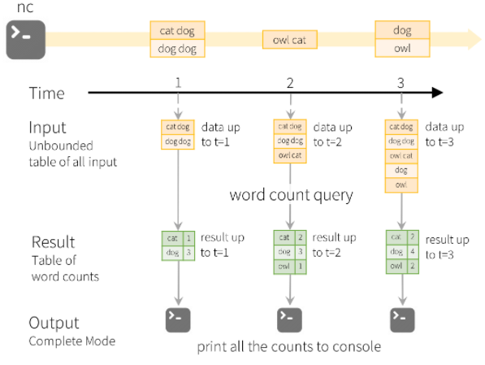

# DataBricks Overview #
- DB is a unified data analytics platform bringing together DS projects & workflows - ML/analytics/DS in one cloud platform 
  - Addressing these users: data engineers, DS, ML engineers & Data analysts 
  - __ML/Data Science Workspace__ using MLFlow/PyTorch/TensorFlow 
    - this is where notepad exists 
  - __Unified Data Service__ using (optimized) ApacheSpark and DeltaLake 
    - DB offers optimized version of Apache Spark - 3-5x faster than OSS Spark
    - benefits of Data Lake and 
    - has RT data integrations
  - __Enterprise Cloud Service__ Delivered on Cloud platform as a managed service - AWS & Azure
    - variety of security controls, compliance options, track billing/usage 
  - __BI Integrations__ plug-ins to PowerBI or Tableau 

## Spark Overview ##  
- spark: unified analytics engine for BI data processing
  -  makes it possible to process big-data and do big-data workflows through distr computing 
  - SQL, graph processing 
  - largest OSS data processing and considered a standard 
  - VERY FAST for large scale data processing, easy to use & unified engine and can plug into many things
  - unified API and engine for SQL queries, streaming data and ML

- Spark API 
  - Spark SQL + DataFrames 
    - Interactive SQL execution: allows use of spark SQL and programming abstraction called dataframes and can act as distr sql query 
    - mucho fast & integrated with spark ecosystem 
  - Spark Streaming
    - analytics needs ability to process streaming data 
    - HDFS, Kafka, Flume, Twitter ... 
  - ML lib 
    - scalable ML library with HQ algos to increase accuracy and speed (100x faster than mapReduce - take that Hadoop!)
    - available in Java, Scala & Python to be used in your workflows 
  - Spark Core 
    - R, SQL, Python, Scala, Java - can all be used for development
    - Generalized execution model/engine 

# Spark Execution Hierarchy #
  - managing infra is annoying so DB offers managed solution 
  - spark uses clusters of machines to break big task into smaller pieces and distr workload across multiple machines
  - Parallelism (parallel threading) 
  
  - **Spark application** execution will create 
    - Multiple **Jobs** that execute in || 
    - Each job is broken up into **Stages** : set of ordered steps that together accomplish a job
    - **Tasks** are created by driver for each stage and assigned a partition of data to process 
      - they are the smallest units of work 

- **Jobs, Stages & Tasks = Execution Hierarchy**
  - Job --> Stage --> Task
  - one spark action could result in one or more jobs 
  - number of stages depends on ops submitted with application
  - tasks are smallest unit of work, they share executor JVM resources 
    - task is the smallest, slots/executors help parallelize work
  - in general - better performance is found through better efficient code rather than tuning deployment


## Spark Architecture Basics From Analytics Vidhya & Florian's Practice Exam ##
- [Understanding Internal Working of Apache Spark](https://www.analyticsvidhya.com/blog/2021/08/understand-the-internal-working-of-apache-spark/)
- [Data Engineering Basics - Spark Architecture](https://www.analyticsvidhya.com/blog/2020/11/data-engineering-for-beginners-get-acquainted-with-the-spark-architecture/)
  - OSS distributed big data processing engine for streaming and batch data with || execution & fault tolerance 
  - APIs in Java, Scala, Python & R 
    - also integrates with Hadoop ecosystem & able to run in hadoop clusters on hadoop data sources including Cassandra
  - developed to address drawbacks of Hadoop MapReduce - meaning Apache Spark uses in-memory computation making it MUCH faster 

   
- **Spark core**: basic functionality of spark - components for task scheduling, memory management, fault recovery, interacting with storage systems... 
- home to the API that defines resilient distributed datasets (RDD) sparks main programming abstraction 
- Runtime Libraries
  - **Spark SQL** spark's package for structured data - allows SQL queries, Hive Query languages and various data sources like Hive tables, JSON & Parquet 
  - **Spark Streaming** spark component enables processing of live streams of data (logs, queues of messages, etc...)
  - **MLlib** common ML library with ML algos (Classification, regression, clustering, filtering & model evaluation, etc... ) all these are designed to scale across cluster 
  - **GraphX** library for manipulating graphs (think social networks...) and performing || graph computation, searching, pathfinding, traversal...
  - **Cluster Managers** spark designed to efficiently scale from 1 - 1000s of nodes running over variety of cluster managers: 
    - standalone scheduler: default for simple stuff - reliable and easy to manage resources on app
    - Hadoop YARN - provided in Hadoop 2: all-purpose cluster manager 
      - most clients have YARN clusters already, can run a variety of java apps, not just spark
      - YARN can isolate/prioritize app jobs, etc 
      - supports kerberos secured HDFS, and don't have to install spark on every node in the cluster 
    - Apache Mesos - general cluster manager that can also run Hadoop MapReduce with Spark & others... 
    - ?K8s?
- **Spark RDD** - resilient distributed dataset: abstraction of distr data containing multiple nodes
  - RDD is immutable - cannot be changed - but evolves by layering on new computations
  - backbone of Apache Spark does 2 main things on RDD: 
    - (1) Transformations : create a new RDD (lazy evaluation)
    - (2) Actions: collect(), count() to return results (execute a "view" of the RDDs)
- **Lazy Transformations** 
  - predicate pushdown is a feature resulting from lazy evaluation, spark will execute these filters as early as it can so it can process the smallest amount of data necessary
  - lineages allow spark to coalesce transformations into stages which enable lazy evaluation 
 
- **Accumulators** 
  - accumulators do not change lazy evaluation model of spark - they are only updated when the query refers to them is executed 

- **Fault Tolerance** : achieved primarily through 2 items below:
  1. Between transformations, DataFrames are *immutable*
  2. since spark records lineage - spark can reproduce any DF in case of failure


## Spark Logical Components ## 

[Overview of Spark Runtime](https://freecontent.manning.com/running-spark-an-overview-of-sparks-runtime-architecture/#post-2923:~:text=Responsibilities%20of%20the%20executors,return%20the%20results%20to%20the%20driver.)

- Seems to be missing Cluster manager?
- **Client JVM**: starts the driver program (spark-submit, spark-shell, or spark API)
  - passes application args to app running inside driver 
- **Driver**: 
  - orchestrates and monitors spark application
  - ONLY ONE driver per spark app
  - Uses the Spark Context & Spark Scheduler to: 
    - request memory and CPU from cluster managers 
    - break application logic into stages & tasks 
    - send tasks to executors
    - collect results 
- **Executors** JVM processes that: accept tasks from the driver, execute those tasks and return results to the driver 
- Use **slots** (interchangeable with CPU cores or threads) for running tasks in parallel 

- *Execution Modes* - Tying Logical Components to Physical Arch 
  - in cluster/client the cluster manager is SEPARATE machine from client/driver
 
- Cluster Mode (this is DB config - since DB driver schedules tasks across executors)
  - User submits pre-compiled JAR, Py script or R script to cluster manager
  - cluster manager launches driver process on worker node in addition to executor processes
  - cluster manager manages all spark app related stuff 
  - seems to be most scalable since you can have multi clients submit to the cluster 
  - client is OUTSIDE of cluster - Driver is on a WORKER NODE of the cluster and executors are spawned on WORKER NODES of the cluster, which then talk to cluster manager head node to schedule things

 
- Client Mode
  - spark driver runs inside the client machine that submitted job - generally OUTSIDE of the cluster
  - spark driver exists on client machine and cluster manager maintains executor processes
  - client machines AKA gateway machines or edge nodes 
  - Client/Driver is on a node OUTSIDE of the cluster which talks to cluster manager head node and to the executors spawned on Worker nodes 

- Local Mode (dev work)
  - runs spark app on single machine 
  - only time where driver can exist on the same node as the cluster manager

## Run-Time Execution Flow - Combined with DB Training ##

 


 

- Basic flow: A driver program communicates with cluster manager to schedule tasks on worker nodes, once complete they send results back to driver program. 

- (A) Spark submit will create a driver program (JVM): **Spark Driver** spark driver first action is to call main method of the program (appears different from "driver" as defined by DB training)
  - (B1) when executing in spark, you give the main class which is the entry point to your program that is executed by the spark driver 
  - (C) Spark Driver creates a **spark context/session** that converts a job query ?or RDD lineage? into a DAG/lineage graph (Directed Acyclic Graph) which splits the job into stages and eventually tasks that get sent to the cluster to send to executors
    - During interactive - `SparkSession` object is created for you, during non-interactive, you create the `SparkSession` object 
    - *[DAG/Lineage](https://databricks.com/blog/2015/06/22/understanding-your-spark-application-through-visualization.html)* can be decomposed into tasks that are executed in parallel 
      - they comprise a job that contains stages of tasks. Some tasks may execute in parallel since they don't depend on one another 
      - are visible in Spark UI and can help optimize queries manually 
      - DAGs represent the execution plan in Spark & are lazily executed like transformations
  - process on a machine responsible for maintainng state of app running on the cluster
  - runs user code which creates RDD dataframes & data units abstractions 
    1. converts user program into tasks
    2. scheduels tasks on executors with the help of the cluster manager
    3. Maintains state & tasks of executors 
      - must be network accessible from worker nodes
- **Spark Cluster Manager** spark execution is agnostic to cluster manager - can use any of available cluster managers, doesn't change behavior - so long as cluster manager can provide executor processes and they communicate - spark doesn't care
  - (B2) Spark Driver will ask Cluster for worker nodes/executors  
  - Spark relies on cluster manager to 
    1. (D) *SCHEDULE & LAUNCH* executors (applies to both client & cluster mode) upon the START of the spark application
    2. (D) Cluster Manager allocates resources for execution of tasks 
    - can dynamically increase/decrease executors based on workload data processing to be done 
    - these often have their own "master/worker" setup - but their terminology is primarily tied to machines rather than processes that spark works on 

>> - DB puts spark driver on cluster manager - so all the above stuff happens in DB's Driver/Instructor
>>    - runs spark application 
>>    - assigns tasks to slots in an executor 
>>    - coordinates work between tasks 
>>    - receives results (if any)
>> - **Driver AKA Teacher/Orchestrator** : for DB a JVM on a machine where application runs & responsible for 3 things:
>>  1. Maintaining info about spark application
>>  2. Responding to user's program
>>  3. Analyzing/Distributing/Scheduling Work across Executors
>>    - In a single DB Cluster only ONE Driver - regardless of number of executors 
>> - driver also looks at data and partitions it across cluster - once partitions are set, never subdivided 
>> - driver is not allowed to touch data: can gather results, not processed partitions
  
- (E) **Spark Executor** a JVM process running on worker node that runs actual programming logic of data processing in the form of tasks (YARN could run multiple executors on a single node - DB does 1 executor PER node)
  - they will register themselves with driver program before beginning execution - so they can accept tasks from driver
  - `spark.executor.cores` will specify how many slots are created per core assigned to an executor 
    - `spark.task.cpus` : how many CPUs per task
    - both the spark.executor.cores and spark.task.cpus affect the max number of tasks an executor can process at the same time
  - slots can span multiple cores - if a task requires multiple cores, it would have to be executed through a slot that spans multiple cores/threads 
  - if executor fails - spark can ID the workload (calculating an RDD) the executor was running in DAG/lineage and assign same workload to another running node
>> - **Worker Node** ~ VM/Machine that hosts executor processes - DB holds 1:1 ratio of worker node:executor
>>  - fixed # of executors allocated at any given time 
>>    - executors share machine level resources
>>  - Each **Executor** : is process running on the worker node that performs 2 kinds of work assigned by driver 
>>      1. Execute code assigned by driver
>>      2. Report state of computation back to driver 
>>        - driver can ask slot their status, and then decide to reassign task to another slot and pick the quickest result from the 2 slots 

  - a copy of program & config put on all worker nodes so that can be locally read
  - launched at beginning of spark app & when you submit jobs, they run for lifetime of spark app (holds state)
    - this can allow isolation on scheduling side (each driver schedules its own tasks) & execution side (tasks from different apps run in different JVMs)
      - allows for data separation since data cannot be shared unless written to external storage 
  1. run tasks 
  2. return results/info on state to driver 
  2. provides in-memory storage for RDD dataset & dataframes cached by user

>>  - **Spark Partition**: chunk of the data to be processed ~ 128MB
>>    - a collection of rows that sits on 1 physical machine in the cluster
>>    - Spark partition != NOT the same as hard disk partition - not related to storage space 
>>    - size/record splits for partition decided by driver 
>>    - each task processes ONE and ONLY ONE partition
>>  - **Cores AKA slots or threads** - when running on DB with 1 to 1 executor to node - can assume these are the same 
>>    - "slot" most accurate term
>>    - Executors have a # of cores/slots & each slot/core can be assigned a task and performs it on provided partition
>>    - driver needs to submit a job to that slot 
>>    - as tasks run, they share executor resources and they share same JVM heap space as others
>>      - meaning a rogue task can bring down an executor 

- Parallelization:
  - *Spark || at 2 levels - a) splitting work at executor & core*
  - Spark can scale parallelization vertically by growing size of executor/node OR horizontally by adding executor/nodes
- each node shares resources, meaning that if one pesky thread goes haywire, it can ruin other threads running on executor 
- allows isolation, because each executor/node is isolated from the others


### **Executor Memory**: [Grishchenko Jan 2016](https://0x0fff.com/spark-memory-management/)

  
- Within Java Heap...
  - **Reserved Memory** - memory reserved by spark system to store spark's internal objects, and its size is hard coded
    - Total Java Heap should be > 1.5 x Reserved Memory (default=300MB)
  - **Spark Memory** 
    - set as `spark.memory.fraction = .75` which defaults to .75 and has a size of: `(JavaHeap - ReservedMemory)*spark.memory.fraction`
    - Spark's memory usage is broken up into 2 items: Execution or Storage divided by `spark.memory.storageFraction = 0.5` which defaults to 0.5
    1. Storage Memory - defaults `MEMORY_AND_DISK`
      - is used for caching partitions derived from dataframes
      - temp space for serialized data to "unroll" 
      - broadcast vars are stored here as cached blocks 
      - Size of: `(JavaHeap - ReservedMemory) * spark.memory.fraction * spark.memory.storageFraction`
    2. Execution Memory
      -  stores objects required during execution of spark tasks 
      - can store hash tables for hash agg
    
  - **User Memory** - memory leftovers, memory after Spark Memory has been allocated
    - `(JavaHeap - ReservedMemory)*(1 - spark.memory.fraction)`
    - can store your own data there, rewrite spark aggs using mapPartition transformations maintaining hash tables... 
    - if you eat up all the space here, you can get OOM

- In general - gc runs faster on a few big objects than many small obj
- disabling serialization can increase memory footprint, but increases performance (serializing can reduce memory usage but lower performance)
- *Tuning options*
  - can increase values for `spark.default.parallelism` and `spark.sql.shuffle.partitions = 200 by default` 

# Query Optimization # 

## Stages, Shuffles & Caching ## 
 

**Augmented with external articles on Wide & Narrow Dependencies** [Dave Canton](https://medium.com/@dvcanton/wide-and-narrow-dependencies-in-apache-spark-21acf2faf031) -- [Saurav Omar](https://sauravomar01.medium.com/wide-vs-narrow-dependencies-in-apache-spark-2cd33bf7ed7d)  

- **Counting Analogy** 
  - LOCAL COUNT: after each slot is done calculating on a particular machine/node/executor it persists the local count so that it can be picked up by the next stage
    - shuffle data: data written to disk so it can be read in later for follow up tasks (shuffle write then read!!!)
    - slots can't just send indv results back to driver and have driver calc total, executors need to do that
  - GLOBAL COUNT: Driver tells a slot to pick up the counts from the remaining slots and sum up the total
    - then take RESULT and return back to driver 
  - stage boundary results when a secondary task cannot begin until ALL the prior task(s) have completed 
    - I.E. a global count cannot occur until all local counts finish
      - exception in spark 3.x that some stages can be run in parallel -  if both inputs will be used to join
    - can become a bottleneck in performance 
    - division of local/global count|distinct|sort|aggregate is an example of a stage boundary
    - only transformations that ultimately require knowledge of the whole dataset require multiple stages

- Shuffle operation is one of the most "expensive" operations in spark 
  1. Pre-processing to create local state data structure suitable to corresponding wide transformation
  2. *writing local results output file - disk I/O*
  3. wait for all tasks to complete before moving past task boundary
  4. *read data back in across executors and from the disk - network and disk I/O* as data gets read in from one executor to another
  5. post-processing operations to conclude the shuffle operation
  - Catalyst Optimizer can consolidate multiple wide transformations into one
    - therefore, it is best to group your wide transformations together so catalyst optimizer can optimize for you
- it is possible to tune shuffling
  - bucketing - presort data on disk, and agg the right way to do a join (not really useful until you are working with TB of data)
  - broadcast hash joins...

- **Distinct Analogy**
  - LOCAL DISTINCT: divide up partitions and assign work to slots 
    - slots will go and retrieve partition to bring locally for processing
    - now each executor has a set of local result records from their partition

 
- Shuffle will move data around the resulting workers consolidating colors 

 
- in second stage - data now exists on different executors - and they will go out and pull data from other executors to bring it to their area to process
  - through magic of spark, they will figure out what data is where and consolidate
- Now that colors are now *distinct* but in different partitions, need to reduce to single records
- can provide these back to driver as the result 

- Shuffle: process of rearranging data within a cluster between stages (triggered by wide operations)
  - compares data across partitions in order to sort it 
- introduces stage boundaries, so wide transformations (by default) create stage boundaries 
  - Example Lineage turned into stages: 
    - Stage 1: "1-read, 2-select, 3-filter, 4A-groupBy, *shuffle-write*"
    - Stage 2: "*shuffle-read*, 4B-groupBy, 5-filter, 6-write" 
  - after a shuffle file has been written, it can be reused so you don't have to execute Stage 1 anymore 
- Can create additional stage breaks using cache
  - Example Lineage turned into stages WITH CACHE: 
    - Stage 1: "1-read, 2-select, 3-filter, 4A-groupBy, shuffle-write, shuffle-read, 4B-groupBy"
    - Stage 2: "**cache-read**, 5-filter, 6-write" 

- during (C) of execution - job is broken up into stages and it needs to be planned:
  - Example Lineage: 1-read, 2-select, 3-filter, 4-groupBy, 5-filter, 6-write
  - **Narrow transformations/dependencies** (select, filter, cast, coalesce, map, union, joins when inputs are co-partitioned): when data required to compute records in a single partition that exist in at least one partition of the parent RDD - 
  - **Wide transformations/dependencies** ( distinct, groupBy, sort, repartitioning, join w/ inputs not co-partitioned): come from many partitions of the parent RDD
  - Marc's definition: when a function execution occurs on an input partition (parent RDD), the partition results (child RDD) can be pieces/subsets of the input partition (parent RDD) **narrow** OR pieces/subsets of MULTIPLE partitions **wide** 
    - said another way - when the child RDD partition comes from only 1 parent RDD partition, it is a narrow transformation, if it comes from multiple parent RDD partitions - then it is a wide transformation
    - because pieces/subsets of multiple partitions requires data sharing between nodes/partitions, this requires data "shuffling"
    - *to optimize performance, you will want to limit data shuffling*


### Caching ###
  - Picking up from a cache can be good/bad - spark now optimizes to the **cache step** rather than all the way back (so if you duplicate work, or decide to filter table further - these optimizations won't take place)
- by default, data of a dataframe is present on a spark cluster only while it is being processed during a query: it is not automatically persisted on the cluster afterwards
  - ??? is this why the .explain(True) for the DFs all point back to the physical parquet file ???
  - Why? because Spark is a processing engine - not data storage system that's why
- if you do cache a dataframe - you should always explicitly evict it from cache using "unpersist" after usage so it doesn't clog memory that could be used for other task executions & can prevent from performing query optimizations
- Caching Usages
  - exploratory data analysis & ML model training

## Stages of Query Optimization
??? Computational Query ==> Execution Plan ???

- When you submit a query to Spark it goes through various stages before it is executed
  - doesn't matter whether query from SQL, scala or python - if you go through the API it goes through this
  1. Unresolved Logical Plan: Query is parsed - tablenames, etc are not resolved 
  2. Analysis through Metadata Catalog: tablenames, columns, data types, functions, databases... are validated against catalog 
      - "catalog" refers to metadata catalog 
  3. Logical plan: Valid query 
  4. Logical Optimization through Catalyst Catalog: First set of optimizations, rewrite/reorder, dedup...
      - Catalyst Catalog is better known as Catalyst Optimizer
  5. Optimized Logical Plan: generated from catalyst catalog optimization and used as input for physical planning
  6. Physical Plans: Catalyst optimizer determines how/when to optimize  and generates 1+ physical plan(s) 
    - different from optimized, because optimization has been applied 

  7. Each optimization applied leads to a different cost-based plan which is put through a cost model
  8. Most optimal physical plan is selected and compiled to RDDs for execution 

- **Adaptive Query Execution (AQE)** in Spark 3.0+
  - *disabled by default* recommended to enable - provides runtime stats plugged into logical plan 
  - reoptimizes queries at materialization points 
  - can dynamically re-optimize queries like: switching join strategies, coalesce shuffle partitions
    - only applies to queries with at least one exchange (join, agg, subquery) that are non-streaming 


### Dynamic Partition Pruning 


- **Partition Pruning**: in DB world - it means optimizer will avoid reading files that do not contain data you are looking for: 
  - Most queries will push down filter as close to data source so you don't have to read the full dataset to filter 
  - the idea is that you can partition your dataset based on commonly filtered fields so that you only filter on partitioned data that HAS your filter condition
    - so you read fewer files into your query 
  - unfortunately - queries are often across multiple tables so it helps a piece of the query for one table, but not all. we need a new strategy...
- Spark will take logical plans and optimize it, then produce 1+ physical plans => optimizing one more time 
  - when building a query across 2 tables dimension & fact, the filter for one, can be applied to the other to pick up the appropriate partitions in a subquery

- Dynamic partition pruning is intended to skip over the data you do not need in the results of a query 
  - does NOT: concatenate columns of similar data types, perform wide transformations, reoptimize physical plans based --and broadcast vars--, reoptimize query plans based on runtime stats collected during execution (AQE does)

- Broadcast variables 
  - are shared across all worker nodes and cached to avoid having to be serialized with every single task
  - broadcast vars are small and meant to fit into memory 
  - because they are immutable - they are never updated
  - broadcast joins are enabled by default in spark 
- yield performance benefits if at least one of the two tables is small in size (<= 10 MB by default). Broadcast hash joins can avoid shuffles because instead of exchanging partitions between executors, they broadcast a small table to all executors that then perform the rest of the join operation locally.
- `spark.sql.autoBroadcastJoinThreshold = 10MB`
`transactionsDf.join(broadcast(itemsDf), "itemId")`

# DB Component Concepts

- **DB Workspace**: grouping of envm to access DB objects such as clusters, Notebooks, Jobs, Data 
  - *Interfaces*: accessible through UI, CLI & REST API
    - REST API has 2 versions: 1.2 and 2.0 - 2.0 is preferred
    - CLI is OSS on github and built on REST API 2.0 
    - Spark UI:
      - has tabs such as Jobs, Stages, Storage, Executors & SQL, JDBC/ODBC Server, Structured Streaming 
        - DAG is under Jobs tab
      - can see properties like spark.executor.memory in Environment tab 
      - Storage tab shows where partitions exist in memory/disk across cluster
- Workspace assets:
  - **Clusters**: set of computational resources and configs where you run your ML/data/adhoc workloads
    - run through set of comands through notebook or automated job (interactive vs batch)
    - runs DB runtime which includes Apache Spark, optimizers, Delta Lake, Java, Py, R, Scala libraries and more 
    - come in 2 kinds of clusters
      - All-purpose clusters: analyze data collaboratively using interactive notebooks, can be created via UI, manually created, and shared among many users
      - Job Clusters: run fast automated jobs - created at runtime and dynamically terminated at the end of the job (cannot restart job cluster)
  - **Notebook**: web-based UI with group of "cells" that allow you to execute commands (reformatted program)
    - DB notebooks allow execution in Scala, Python, SQL, R 
    - can be exported as DBC files that can be migrated/imported etc
    - Notebooks are the "sql client" and can be executed interactively 
    - also provides DBUtils which is only accessible through notebooks 
      - DBUtils allow you to admin obj storage & chain/parameterize notebooks & manage secrets 
  - **Job**: construct to house indv execution of a notebook run - either in ad-hoc submission (interactive) OR batch scheduled run 
    - can be created/called through UI, CLI & REST API 
    - job status can be monitored via UI, CLI, REST & email
  - Data **DB Filesystem DBFS**: distr f/s mounted into each DB workspace and is a layer over cloud object store 
    - contains directories, data, files, etc
    - auto-populated with sample files 
    - Files in DBFS are persisted in object store 
    - through DBFS can configure access controls etc to access data you need without data duplication/migration 
  - Data **Metastore** : Manages tables and permissions and enables granting of rights/sharing data 
    - defaults to databricks central hive metastore - but can be externalized


## Spark SQL & DataFrame API Intro

- **Spark SQL** is a module for structured data processing with multiple interfaces: SQL OR Dataframe API: allowing use of Python, Scala, Java, R 
- **Query Engine**: converts execution of all queries so they can run on the same engine, therefore
  - you can have SQL, python, Scala all coding and able to share/reuse code 
  - **Query Plans**: ?query program? 
    - the translated query 
    - With databricks & Spark, it can optimize the query plan automatically before execution 
  - **RDDs**: Resilient Distr dataset (low level representation of datasets) 
    - spark converts our commands into RDD so we don't have to code in it

- **DataFrames**: distributed collection of data grouped into named columns 
  - different from python/R dataframes - py/R are not distributed, whereas spark df's are distributed
  - are immutable because built on RDD (which is immutable)
  - based on named columns (more flexible than RDD)
- **Schema**: table metadata of dataframe (col names & types) 
  - Dataframe **transformations** are methods that return a new dataframe and are *lazily* evaluated (not actually run until later - ?view?)  
    - {select, where, orderBy, groupBy...} - creates a plan (~ to a view)
  - Dataframe **actions** are methods that trigger computation {count, collect, take, describe, summary, first/head, show...} are *eagerly* evaluated
- **Dataset API**: available in SCALA but not python 
  - uses fixed typing and used for Obj oriented programming 
  - can support unstructured data

# Stream Processing
## Stream Processing 
- Reading through the [online guide](https://spark.apache.org/docs/latest/structured-streaming-programming-guide.html) might be better than online video
- **stream processing**: act of continuously incorporating new data to a query result
  - input data is unbounded: no predetermined beginning/end
  - data forms series of events from a processing system (IoT sensory data, CC T(x), etc)
  - calc into hourly results, etc and keep up to date 
- **Batch processing**: runs on fixed input dataset - and will only compute ONCE 
- Need ability to get consistent results when querying in batch or streaming, therefore structured streaming 
  - Continuous Applications: streaming, batch, interactive all working on same data to deliver same product 
- Stream processing use-cases:
  - Notification/Alerting
  - RT Reporting
  - Incremental ETL: reduce latency for ETL for efficient queries, can get new data much faster 
  - RT data updates
  - RT decision Making - new business inputs lead to business logic decisions 
  - Online ML - most complex because requires joins, ML lib, etc
- Batch vs Streaming 
  - batch is easier to understand, troubleshoot, etc & higher throughput
  - streaming allows lower latency for fast responsetimes, efficient updates & automatic bookkeeping on new data 
    - streaming system can remember state from prior calc and adjust metrics on arrival of new data 
- **Streaming Methodologies**
  - Continuous Processing 
    - each node in the system, it is listening to updates from other nodes and passing results to child nodes 
    - Advantages: lowest possible latency with each node responding to message
    - Cons: low throughput - because of high overhead per record (contacting OS to send a packet)
      - generally have static deployments that cannot be updated without restarts -> load balancing
  - Micro Batch Processing
    - wait a certain trigger interval to accumulate data before executing batch in parallel, on a cluster behind the scenes
    - can get high throughput through batch processing (sending all at once, rather than one at a time) 
      - means they have comparatively less overhead, and in general require fewer nodes compared to Cont' Processing 
      - can use dynamic LB techniques to update/lower ?tasks? 
    - Cons: higher base latency because of trigger interval
    - when data coming too fast to be consumed continuously 
- Spark has done micro-batch processing because throughput was required 
  - in structured streaming, continuous processing is under dev
- when deciding cont vs micro-batch:
  - Look at latency requirements - micro batch latency ~ 100ms - 1s
  - TCO: Total Cost of Operation - lower # of nodes and admin overhead on cluster mgt etc
- Processing Micro-batch
  - Goal is to process ALL data arrived for each interval in under the amount of time the following interval processing begins 
  - Losing Data:
    - if you process data from a TCP/IP stream every 10 seconds and it takes 15 seconds to process, you will lose 5 seconds of the following interval of data 
    - depending on what you are analyzing, the data loss could be negligible or a big deal 
    - if you process from a pub/sub system, you simply fall behind in processing data. 
      - if delayed long enouhg, pub/sub will run into limits of holding data 
      - should add cluster nodes to stay current 
- Spark treats micro batches as continuous updates new rows appended to an unbound table 
  - dev generates a query on the table AS-IF it were static 
  - computation on input table is then pushed to results table 
    - results table is written to an output sink 
- Structured Streaming: treat a live datastream as a table that is cont' appended ~ batch processing
  - batch queries are simply run as micro queries on appended rows to your stream AKA unbounded table 
    - queries remain the same whether running in batch or streaming 
  - data items that stream in are ~ to new rows in a table 
    - the streaming query job will process new data incrementally, and update state as needed and update results 
    - run in fault tolerant fashion... 
  - afterwards results are updated into a result table which go into a sink




- Streaming data issues that batch doesn't deal with: Event time, out of order data
  - therefore stuctured streaming does have certain query limitations & new concepts 
- Structured Streaming + Apache Spark Batch, etc = Continuous Application
  - end-to-end app that reacts to data in RT combining all these tools
- **Supported input sources for streaming**
  - Apache Kafka, Files from distr system - HDFS/S3, socket source for testing, stable source APIs for streaming connections 
  - file source, kafka, socket source & rate source
```
Starting Streaming Queries
Once you have defined the final result DataFrame/Dataset, all that is left is for you to start the streaming computation. To do that, you have to use the DataStreamWriter (Scala/Java/Python docs) returned through Dataset.writeStream(). You will have to specify one or more of the following in this interface.

Details of the output sink: Data format, location, etc.

Output mode: Specify what gets written to the output sink.

Query name: Optionally, specify a unique name of the query for identification.

Trigger interval: Optionally, specify the trigger interval. If it is not specified, the system will check for availability of new data as soon as the previous processing has been completed. If a trigger time is missed because the previous processing has not been completed, then the system will trigger processing immediately.

Checkpoint location: For some output sinks where the end-to-end fault-tolerance can be guaranteed, specify the location where the system will write all the checkpoint information. This should be a directory in an HDFS-compatible fault-tolerant file system. The semantics of checkpointing is discussed in more detail in the next section.
```
- **Supported output sinks for streaming**: define *what* data to write out
  - file format - dumps to parquet, csv, JSON...
  - Kafka - writes to 1+ topics in Kafka
  - console - prints to stdout (generally for debugging)
  - memory - updates in-mem table that can be queried through SQL or dataframe API
  - Foreach - escape hatch - write your own kind of sink
  - Delta - DB proprietary sink
- What are sinks? specify destination for result set of a stream, 
  - sinks + execution engine, help track process of data processing 
  - **Output modes**: define *how* data is output  
    - *certain queries/sinks may only support certain output modes*
      - I.E. gathering all data - don't use complete, use append. If you are groupby agg, complete/update work, but not append
    - *complete*: entire updated output result table is written to the sink (sink implementation decides how to write entire table)
    - *append*: only new records appended to result table since last trigger are written to sink
    - *update*: only new records updated since last trigger will be output to sink
- **Trigger Types**: *when* data is output - when structured streaming should check for new input data and update results
  - *Default*: process each micro-batch as soon as previous one has been processed - in general the fasted
    - if you have a file sink - can mean you write tons of small files on fs
  - *Fixed Interval*: time-based where micro-batch is kicked off at pre-defined intervals
  - *One-Time*: process all available data as a single micro-batch and then stop query
  - *Continuous Processing*: Long-running tasks that continuously read, process and write data as soon as events available (experimental)
- Fault Tolerance:
  - if a failure occurs, streaming engine attempts to restart and/or reprocess data - can only do that if streaming source is replayable
    - assumes data source has kinesis sequence numbers, kafka offsets... 
  - End to end fault tolerance which is guaranteed by: 
    - checkpointing & write-ahead logs: to record offset range of data being processed during each interval
      - appears to store state in case data is lost
    - idempotent sinks: generate same written data for a given input, whether 1 or multiple writes are performed - even if node fails during write & can overwrite based on offsets
    - replayable data sources
  - these guarantee end-to-end exactly once semantics under any failure condition 
- Streaming Query Operations:
  - stop stream
  - await termination
  - status, isActive
  - recent progress,
  - Metadata: name, ID, runID...
 

## Streming Processing Lab ##
```
  .withColumn("mobile", col("device").isin(["iOS", "Android"]))
```